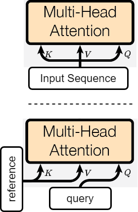
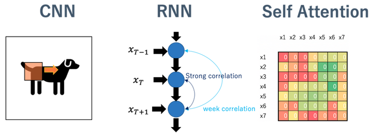

<!-- _class: cover_b -->
<!-- _header: "" -->
<!-- _footer: "" -->
<!-- _paginate: "" -->
<!-- _backgroundImage: url('https://marp.app/assets/hero-background.svg') -->

# Robot Perception and Control

###### Introduction

Last updated: Jul / 25 /2024
Kashu Yamazaki
kyamazak@andrew.cmu.edu


## Logistics

<!-- _class: trans -->
<!-- _footer: "" -->
<!-- _paginate: "" -->

## Logistics


**Lectures**

- Time: 00:00 - 00:00 (CST), MWF / TuTh
- Location: JBHT 000 (in person)

**Office Hours**

- Instructor: By appointment via email
- TA: 00:00 - 00:00 (CST), MWF


## Logistics

**Grading Policy**

- HWs (30%): 5 home works
- Quizzes (10%): 5 quizzes each worth 20 points
- Midterm (30%): $\max(0.2 \cdot \sum(\text{quizzes}) + 0.8 \cdot \text{midterm}, \text{midterm})$
- Final Project (30%): project report + presentation

A: 90\% ~ , B: 80\% ~ 90 \%, C: 70\% ~ 80 \%, D: 60\% ~ 70 \%

**Submission Policy**
- HWs: $-5\%$ penalty / day from the total points of the assignment after due.
- Final Project: No late submission.

**Every submission is due midnight (11:59 pm) on the date specified.**

## Robot Learning

<!-- _class: trans -->
<!-- _footer: "" -->
<!-- _paginate: "" -->

## 1. Robot Learning

<!-- _class: cols-3 -->

<div class=ldiv>


Manipulation

</div>

<div class=mdiv>


Locomotion
</div>

<div class=rdiv>


Mobile Manipulation

</div>


## 1.1 What is Robot Learning?

**Robot learning** is a research field at the intersection of **machine learning** and **robotics**. It studies techniques allowing a robot to acquire novel skills or adapt to its environment through learning algorithms.


- *Sensing*: observe the physical world through multimodal senses
- *Perception*: acquiring knowledge from sensor data
- *Action*: act on the environment to execute task / acquire new observation

>A key challenge in Robot Learning is to close the **perception-action loop**.


## 1.2 When Should Robots Learn?

Robots should be designed to learn in situations where pre-existing knowledge or established protocols are insufficient or non-existent, requiring them to discover knowledge from data:

- High Environmental Uncertainty
- Significant Variation in Observations
- Lack of Reliable Priors
- Complex or Unstructured Environments
- Continuous Improvement

<!-- _class:  bq-red -->
> Learning is **NOT** the solution to every problem in robotics.
>
> When the task can be modeled without knowledge from data, learning algorithm is not required (and learning algorithm tend to perform worse).


## 1.3 How to make robots learn?

These days, many robot learning methods are based on **deep neural networks** with various learning algorithms (supervised learning, unsupervised learning, reinforcement learning, etc.).


## Multi-modality Sensory

<!-- _class: cols-3 -->

<div class=ldiv>


LiDAR sensor

Stereo Depth sensor

</div>

<div class=mdiv>


RGBD camera, Microphone 

IMU (Gyro/Acceleration/Barometer)

</div>

<div class=rdiv>


Tactile sensor

Joint Position/Velocity/Torque

</div>

## Deep Learning

<!-- _class: trans -->
<!-- _footer: "" -->
<!-- _paginate: "" -->

## 2.1 Basics

## Backpropagation 

## MLP

## CNN

## RNN


## Scaled Dot product Attention

An attention mechanism where the dot products are scaled down by $\sqrt{d_k}$. 
* Motivated by the concern when the input is large, the softmax function may have an extremely small gradient, hard for efficient learning.

* Calculate *similarity* from $Q$ and $K$, and scale $V$ by the similarity.

* Can be viewed as **differentiable dictionary**.

$$
\text{Attention}(Q, K, V) = \text{softmax}\left( \frac{QK^\boldsymbol{\top}}{\sqrt{d_k}}\right)V
$$


## Multi-Head Attention (MHA)

A module for attention mechanisms which runs through an attention mechanism several times in parallel. 

$$
h_i = \text{Attention}(QW_i^Q, KW_i^K, VW_i^V)
$$
$$
\text{MultiHead}(Q, K, V) = [h_0\dots h_n]W
$$

- The multiple attention heads allows for attending to parts of the sequence differently.
- When $Q, K, V = X$, this is called **self-attention**.
- Only a small subset of heads appear to be important for the translation task. Especially the encoder self-attention heads, can be removed without seriously affecting performance [[1](https://arxiv.org/pdf/1905.09418.pdf)].


## Masked Multi-Head Attention

Masking of the unwanted tokens can be done by setting them to $-\infty$. The binary mask $M \in \{0, -\infty \}$ is added to the attention scores so that attention weight will be zero on those unwanted tokens.

$$
\text{Attention}(Q, K, V) = \text{softmax}\left( \frac{QK^\boldsymbol{\top} + M}{\sqrt{d_k}}\right)V
$$

Sample implementation:
```python
qkv = to_qvk(x) # to_qvk = nn.Linear(dim, dim_head * heads * 3, bias=False)
q, k, v = tuple(rearrange(qkv, 'b t (d k h) -> k b h t d ', k=3, h=num_heads))
scaled_dot_prod = torch.einsum('b h i d , b h j d -> b h i j', q, k) * scale
scaled_dot_prod = scaled_dot_prod.masked_fill(mask, -np.inf)
attention = torch.softmax(scaled_dot_prod, dim=-1)
out = torch.einsum('b h i j , b h j d -> b h i d', attention, v)
out = rearrange(out, "b h t d -> b t (h d)")
```

## Self-Attention vs Cross-Attention

**Self-Attention**: all of the $K, V,$ and $Q$ come from the same input source. 
* Each position in the encoder can attend to all positions in the previous layer of the encoder.

**Cross-Attention**: the $K, V$ come from the reference source and the $Q$ come from the querying source.
* This allows every position in the decoder to attend over all positions in the input sequence.
* One way to realize cross-modal fusion.



## Inductive Bias



**Inductive bias (IB)** is the assumption(s) of data that the model holds [[1](https://towardsdatascience.com/recent-developments-and-views-on-computer-vision-x-transformer-ed32a2c72654)].
* **CNN**: information in the data is locally aggregated. (strong IB)
* **RNN**: the data is highly correlated with the previous time. (strong IB)
* **Self Attention**: just correlating all features with each other. (weak IB)

## Resources: Books

<!-- _class: cols-2 -->

<div class=ldiv>


*Deep Learning*
by Ian Goodfellow, Yoshua Bengio, Aaron Courville

</div>

<div class=rdiv>


*Modern Robotics: Mechanics, Planning, and Control*
by Kevin M. Lynch, Frank C. Park

</div>

## Resources: Online Materials

- [CS391R (UT Austin) by Yuke Zhu](https://www.cs.utexas.edu/~yukez/cs391r_fall2023/syllabus.html): lecture slides