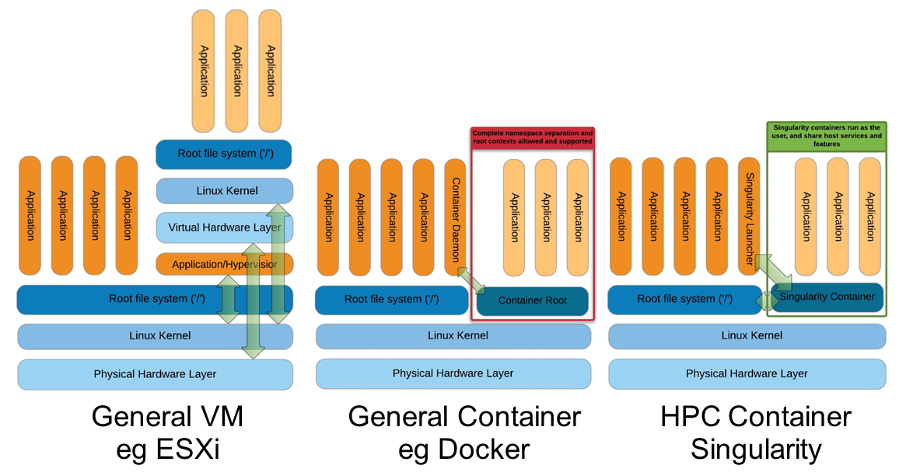
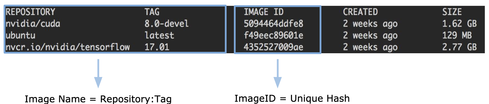
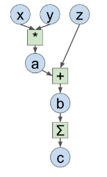

<!-- _class: cover_b -->
<!-- _header: "" -->
<!-- _footer: "" -->
<!-- _paginate: "" -->
<!-- _backgroundImage: url('https://marp.app/assets/hero-background.svg') -->

# Robot Perception and Control

###### Tutorial

Last updated: Jul / 25 /2024
Kashu Yamazaki
kyamazak@andrew.cmu.edu

## Docker 🐳

<!-- _class: trans -->
<!-- _footer: "" -->
<!-- _paginate: "" -->

## Virtual Machine vs Containers

A **Virtual Machine (VM)** virtualizes the underlying hardware by means of a hypervisor, while it provides operating-system-level virtualization. **Containers** are more lightweight than VMs, as they are not emulating hardware.



## Why Docker?

There are several merits of using Docker.

- We can **share the environment** 😀
    - You can share the Docker Image to help others setup and run your code. 
    - **No more repeated setup process on every different machine!**
- We can **improve reproducibility**. 
    - The code works even after several years on the Image.
    - No more suffering from messing up your environment after installing some software updates.

<!-- _class:  bq-red -->

> Note for Mac and Windows
>
> Docker uses the Linux kernel to manage resources between containers; Docker has to run in a Linux virtual machine for Mac and Windows, which makes some feature fail on Mac and Windows.
> Also the chip architecture needs to be considered (`M1` and `M2`): some has to cross compile `docker buildx build`

## Structure of Docker Environment


* **Image**: a template that contains middleware settings or commands needed to launch a container.
* **Container**: a virtual environment created based on a Docker Image where web servers, PyTorch environment, ... run. 
* **Registry**: Docker Hub is the place where the Images are published and shared.


## Managing Images and Containers

<!-- _class: pon-3 -->

<div class=ldiv>

- **List Images**: `docker images`
- **Remove an Image**: `docker rmi <imageID>`
- **Prune an Image**: `docker image prune`
- **Get an Image**: `docker pull`
- **Build an Image**: `docker build -t <imageName> -f Dockerfile .`

</div>

<div class=rdiv>

- **List Containers**: `docker ps -a`
- **Remove a Container**: `docker rm <containerID>`
- **Start a Container**: `docker run <imageName>`
- **Attach to a running Shell**: `docker exec -it <containerID> bash` 

</div>

<div class="bdiv">

With `docker images` command, you can check `<imageName>` and `<imageID>`.



</div>

## Getting your own Image

You can write a `Dockerfile` to create your own image:

```Dockerfile
# Specify the base image: you can explore docker hub.
FROM pytorch/pytorch:2.0.1-cuda11.7-cudnn8-runtime
# Install dependencies and command-line tools.
RUN apt-get update && apt-get install -y build-essential cmake git wget
# Set the working directory.
WORKDIR /workspace
ENV HOME /workspace
# Pip install python packages.
RUN pip install timm opencv-python
```

Then: `docker build -t <imageName> -f /path/to/Dockerfile .` to build the image.
You can also publish your image on DockerHub by: `docker login && docker push <imageName>`

## Running Containers

**Docker run Options**

- `--rm` remove the container after it exits
- `--gpus` for GPU isolation
- `-i -t` or `-it` interactive, and connect a "tty"
- `-p 5004:8888` map port 8888 on the host to 5004 inside the container
- `-v ~/data:/data` map storage volume from host to container (bind mount) i.e. bind the `~/data` directory in your home directory to `/data` in the container

Starts TensorFlow with ports, volumes, console, and comment (All 1 line):

```sh
docker run --rm -it --gpus all -p 5004:8888 -v ~/data:/data <imageName>
```


## Running GUI Applications with Docker

1. Allow local X11 connections
    ```bash 
    xhost local:root
    ```

2. Run docker with options 
- Intel GPU

    ```bash 
    docker run --device=/dev/dri:/dev/dri -v /tmp/.X11-unix:/tmp/.X11-unix -e DISPLAY
    ```

- NVIDIA GPU

    ```bash
    docker run  --gpus 'all,"capabilities=compute,utility,graphics"' -v /tmp/.X11-unix:/tmp/.X11-unix -e DISPLAY
    ```


## PyTorch 🔥

<!-- _class: trans -->
<!-- _footer: "" -->
<!-- _paginate: "" -->

## Computational Graph

<!-- _class: cols-3 -->

<div class=ldiv>

Two elements of computational graph: `valuable (blue)`  and `operator (green)`.



$$
c = \sum_{i}^{B}\sum_{j}^{C}(x_{i,j} \cdot y_{i,j} + z_{i,j})
$$

</div>
<div class=mdiv>

```python
import numpy as np

B, C = 3, 4
x = np.random.randn(B,C)
y = np.random.randn(B,C)
z = np.random.randn(B,C)

# forward pass
a = x * y
b = a + z
c = np.sum(b)

# backward pass (gradient computation)
grad_c = np.ones((1))
grad_b = np.tile(grad_c, b.shape)
grad_a = grad_b.copy()
grad_z = grad_b.copy()
grad_x = grad_a * y
grad_y = grad_a * x
```

</div>
<div class=rdiv>

```python
import torch

B, C = 3, 4
x = torch.randn(B,C, requires_grad=True)
y = torch.randn(B,C, requires_grad=True)
z = torch.randn(B,C, requires_grad=True)

# forward pass
a = x * y
b = a + z
c = b.sum()

# backward pass (gradient computation)
c.backward()
```

PyTorch implements computational graph with: `tensor` and `function`, which comes with AD for easy gradient computation. 

</div>

## Tensors

## Devices

<!-- _class: cols-2 -->

<div class=ldiv>

**CUDA and CPU**

```python
device = "cuda" if torch.cuda.is_available() else "cpu"

# move the array to a device
torch_arr = torch_arr.to(device)
print(torch_arr.device)

# move to cuda
torch_arr = torch_arr.to("cuda")
torch_arr = torch_arr.to("cuda:0") # GPU at idx 0
torch_arr = torch_arr.cuda()

# move to cpu
torch_arr = torch_arr.to("cpu")
torch_arr = torch_arr.cpu()
```

</div>
<div class=rdiv>

**NumPy Array to Torch Tensor (CPU)**

```python
# Numpy to Torch
torch_arr = torch.from_numpy(np_arr) # cpu tensor

# Torch to Numpy
np_arr = torch_arr.cpu().numpy() # first move to cpu
```

**Type Checking**

```python
type(torch_arr.cuda())
# torch.cuda.FloatTensor
type(torch_arr.cpu())
# torch.cpu.FloatTensor
type(np_arr)
# numpy.ndarray
```

</div>

## Gradients


## Optimizers and Loss functions


## nn.Module [docs](https://pytorch.org/docs/stable/notes/modules.html)

A neural network model and its components can be represented by a `nn.Module` class.

```python
class MLP(nn.Module):
    def __init__(self, ):
        super().__init__() # you have to call this in all child class!
        self.layer1 = nn.Linear(764, 100) # nn.Linear also inherits nn.Module and implements Linear layer (y = w*x + b)
        self.layer2 = nn.Linear(100, 10)

    def forward(self, x): # forward is called in __call__() so that you can run the forward pass just by module(x)
        return self.layer2(F.relu(self.layer(x)))
```

- `__init__`: defines the parts that make up the model (sub-module or parameters)
- `forward`: performs the actual forward computation

PyTorch pre-defines common modules of the modern deep neural networks. See more at [basic building blocks](https://pytorch.org/docs/stable/nn.html) 