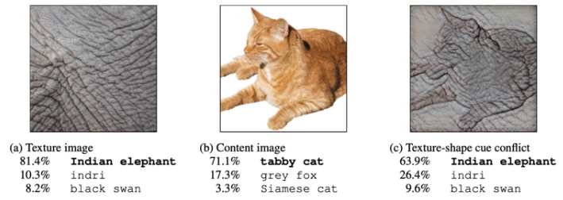

<!-- _class: cover_b -->
<!-- _header: "" -->
<!-- _footer: "" -->
<!-- _paginate: "" -->
<!-- _backgroundImage: url('https://marp.app/assets/hero-background.svg') -->

# Robot Perception and Control

###### Robot Perception in 2D

Last updated: Jul / 25 /2024
Kashu Yamazaki
kyamazak@andrew.cmu.edu

## Image Perception Tasks


## Image Classification

<!-- _class: trans -->
<!-- _footer: "" -->
<!-- _paginate: "" -->

## ImageNet

ImageNet is a large-scale dataset for image classification, known for its use in Large Scale Visual Recognition Challenge (ILSVRC). 

- (2009): ImageNet was released by Dr. *Li Fei-Fei* team.
- (2012): **AlexNet** made a breakthrough achieving 16% top-5 error rate - kickstarting the boom in deep learning.
- (2017): 95% accuracy reached and ILSVRC concluded.

<!-- _class:  bq-blue -->
> After ILSVRC Challenge 
> 
> ImageNet continues to be a valuable resource for researchers for pre-training image encoder (backbone) models.


## AlexNet

AlexNet is a **convolutional neural network** (CNN) architecture, designed by Alex Krizhevsky that contains eight layers: the first five are convolutional layers, some of them followed by max-pooling layers, and the last three are fully connected layers.


<!-- _class:  bq-blue -->
> Influence
> 
> AlexNet is considered one of the most influential papers published in computer vision, having spurred many more papers published employing CNNs and GPUs to accelerate deep learning.

## ResNet [arxiv](https://arxiv.org/abs/1512.03385)

ResNet layers learn **residual functions** with respect to the layer inputs. 
A residual function $F_\theta(x) = H_\phi(x) - x$ represents difference between the underlying function $y = H_\phi(x)$ and the input $x$. A general form of ResNet layer is written as:

$$
y = F_\theta(x) + x
$$

The operation of $+ x$ is called **residual connection** that performs an identity mapping to connect the input of the subnetwork $F_\theta$ with its output. 

<!-- _class:  bq-blue -->
> Influence
> 
> Learning the residual function can make the training of very deep networks easier. It helps in addressing the **vanishing gradient problem**.


## ViT [arxiv](https://arxiv.org/abs/2010.11929)

Applied pure transformer directly to sequences of *image patches*.

- An image patch is a $16\times16$ pixel crop of the image that will be treated as an image token.
- The patchify stem is implemented by a stride-$p$, $p\times p$ convolution ($p = 16$ by default) applied to the input image [[1](https://arxiv.org/abs/2106.14881)]. 

<!-- _class:  bq-blue -->
> Influence
> 
> Performance scales with dataset size and becomes a new de facto for image backbone.


## Representing Image as Patches 
<!-- https://theaisummer.com/vision-transformer/ -->
For an input image $x\in \mathbb{R}^{H\times W\times C}$ and patch size $p$, the $N= \frac{HW}{p^2}$ image patches $x_p\in \mathbb{R}^{N\times (p^2 C)}$ will be created.

- $p = 16$ for original ViT; thus $256\times256$ image is represented as $16\times16$ *image tokens*. 

Sample implementation:
```python
from einops import rearrange
proj = nn.Linear((patch_size**2)*channels, dim)
x_p = rearrange(img, 'b c (h p) (w p) -> b (h w) (p p c)', p = patch_size)
embedding = proj(x_p)
```

or equivalently:
```python
conv = nn.Conv2d(channels, dim, kernel_size=patch_size, stride=patch_size)
embedding = rearrange(conv(img), 'b c h w -> b (h w) c')
```

## ViT vs ResNet

- MHSAs and Convs exhibit opposite behaviors. **MHSAs are low-pass filters**, but **Convs are high-pass filters**.

- MHSAs improve not only accuracy but also generalization by flattening the loss landscapes.

[[1](https://arxiv.org/abs/2202.06709)]


## ViT vs ResNet

ViT models are less effective in capturing the high-frequency components (related to local structures) of images than CNN models [[1](https://arxiv.org/abs/2204.00993)]. 
For ViTs to capture high-frequency components:
* knowledge distillation using a CNN teacher model [[2](https://arxiv.org/abs/2012.12877)].
* utilizing convolutional-like operation or multi-scale feature maps.  
* use **RandAugment** [[3](https://arxiv.org/abs/1909.13719)]. 


## ViT vs ResNet

Robustness to input perturbations: 
- **ResNet**: noise has a high frequency component and localized structure [[1](https://arxiv.org/abs/1412.6572)]
- **ViT**: relatively low frequency component and a large structure (The border is clearly visible in the $16\times 16$ size patch.)

    - When pre-trained with a sufficient amount of data, ViT are at least as robust as the ResNet counterparts on a broad range of perturbations [[2](https://arxiv.org/abs/2103.14586)].


## ViT vs ResNet [arxiv](https://arxiv.org/abs/2105.07197)

Is dicision based on texture or shape?

- **ResNet**: relies on texture rather than shape [[2](https://arxiv.org/abs/1811.12231)]
- **ViT**: little more robust to texture perturbation
- **Human**: much robust to texture perturbation




## CLIP [arxiv](https://arxiv.org/abs/2103.00020) [github](https://github.com/openai/CLIP)

Learning directly from raw text about images leverages *a broader source of supervision* compared to using a fixed set of predetermined object categories. CLIP introduced a simple yet effective contrastive objective to learn a vision-language embedding space, where similar concepts are pulled together and different concepts are pushed apart.


## CLIP [arxiv](https://arxiv.org/abs/2103.00020) [github](https://github.com/openai/CLIP)

Sample implementation:

```python
# extract feature representations of each modality
I_f = image_encoder(I) #[n, d_i]
T_f = text_encoder(T)  #[n, d_t]
# joint multimodal embedding [n, d_e]
I_e = l2_normalize(np.dot(I_f, W_i), axis=1)
T_e = l2_normalize(np.dot(T_f, W_t), axis=1)
# scaled pairwise cosine similarities [n, n]
logits = np.dot(I_e, T_e.T) * np.exp(t)
# symmetric loss function
labels = np.arange(n)
loss_i = cross_entropy_loss(logits, labels, axis=0)
loss_t = cross_entropy_loss(logits, labels, axis=1)
loss = (loss_i + loss_t)/2
```


## Object Detection

<!-- _class: trans -->
<!-- _footer: "" -->
<!-- _paginate: "" -->

## YOLO

## DETR

## Segmentation

<!-- _class: trans -->
<!-- _footer: "" -->
<!-- _paginate: "" -->

## SAM [arxiv](https://arxiv.org/abs/2304.02643)


## Robot Perception