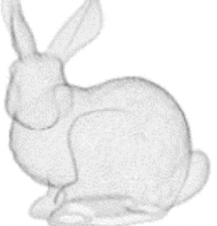

<!-- _class: cover_b -->
<!-- _header: "" -->
<!-- _footer: "" -->
<!-- _paginate: "" -->
<!-- _backgroundImage: url('https://marp.app/assets/hero-background.svg') -->

# Robot Perception and Control

###### Robot Perception in 3D

Last updated: Jul / 25 /2024
Kashu Yamazaki
kyamazak@andrew.cmu.edu

## Homogeneous Transformations

Rigid motions can be represented in set of matrices of the following form so that composition of rigid motions can be reduced to matrix multiplication.

$$
\text{H} = \begin{bmatrix}
R & d \\
0 & 1
\end{bmatrix}, R \in SO(3), d \in \mathbb{R}^3
$$

This represents a homogeneous transformation matrix H, where R is a rotation matrix from the special orthogonal group SO(3), and d is a translation vector in 3D. The inverse transformation is given by:

$$
\text{H}^{-1} = \begin{bmatrix}
R^\intercal & -R^\intercal d \\
0 & 1
\end{bmatrix}
$$

## Homogeneous Transformations

The most general homogeneous transformation that we consider may be written as:

$$
\text{H}_{1}^{0} = \begin{bmatrix}
n_x & s_x & a_x & d_x \\
n_y & s_y & a_y & d_y \\
n_z & s_z & a_z & d_z \\
0 & 0 & 0 & 1 \\
\end{bmatrix} = \begin{bmatrix}
\mathbf{n} & \mathbf{s} & \mathbf{a} & \mathbf{d} \\
0 & 0 & 0 & 1 
\end{bmatrix} 
$$

Here, $\mathbf{n}$ is a vector representing the direction of $x_1$ ($x$ axis of new frame) in the original frame, $\mathbf{s}$ represents the direction of $y_1$, and $\mathbf{a}$ represents the direction of $z_1$. The vector $\mathbf{d}$ represents the position of the new origin in the original frame.

## Rotation Matrices

<!-- _class: cols-2 -->

Translation along the axis:

$$
\text{Trans}_{x,a} = \begin{bmatrix}
1 & 0 & 0 & a \\
0 & 1 & 0 & 0 \\
0 & 0 & 1 & 0 \\
0 & 0 & 0 & 1 \\
\end{bmatrix}
$$

$$
\text{Trans}_{y,b} = \begin{bmatrix}
1 & 0 & 0 & 0 \\
0 & 1 & 0 & b \\
0 & 0 & 1 & 0 \\
0 & 0 & 0 & 1 \\
\end{bmatrix}
$$

$$
\text{Trans}_{z,c} = \begin{bmatrix}
1 & 0 & 0 & 0 \\
0 & 1 & 0 & 0 \\
0 & 0 & 1 & c \\
0 & 0 & 0 & 1 \\
\end{bmatrix}
$$

Rotation around the axis:

$$
\text{Rot}_{x,\alpha} = \begin{bmatrix}
1 & 0 & 0 & 0 \\
0 & \cos \alpha & -\sin \alpha & 0 \\
0 & \sin \alpha & \cos \alpha & 0 \\
0 & 0 & 0 & 1 \\
\end{bmatrix}
$$

$$
\text{Rot}_{y,\beta} = \begin{bmatrix}
\cos \beta & 0 & \sin \beta & 0 \\
0 & 1 & 0 & 0 \\
-\sin \beta & 0 & \cos \beta & 0 \\
0 & 0 & 0 & 1 \\
\end{bmatrix}
$$

$$
\text{Rot}_{z,\gamma} = \begin{bmatrix}
\cos \gamma & -\sin \gamma & 0 & 0 \\
\sin \gamma & \cos \gamma & 0 & 0 \\
0 & 0 & 1 & 0 \\
0 & 0 & 0 & 1 \\
\end{bmatrix}
$$

## Traditional 3D representations

**Voxel**: simple extension of concept of pixel into 3D
$\checkmark$ we can reuse the thechniques (CNNs, etc.) used in images
✗ occupies too much memory (thus usually limited to $\sim 256^3$)

**Octree**: hierarchical voxel
$\checkmark$ high quality 3D with less memory
✗ hard to generate and store

**Point Cloud**: group of points represents the 3D scene
$\checkmark$ much compact compared to voxel
✗ cannot represent the surface

**Mesh**: group of triangles (polygons) represents the 3D scene
$\checkmark$ very compact
✗ hard to obtain the mesh

## Neural Fields

A field is a physical quantity that has a value for each point in space and time. A field can be expressed as a function that takes **spacial coordinates as independent variables**. A neural field is a field that is parameterized fully or partially by neural networks.

| fields | input/output | example |
|---|---|---|
| Occupancy Field | position $\rightarrow$ existance | Occupancy Networks |
| Distance Field | position $\rightarrow$ distance | DeepSDF, PIFu | 
| Radiance Field | position + direction $\rightarrow$ color + density | NeRF | 
| Scene Flow Field | position $\rightarrow$ scene flow | Neural Scene Flow Fields | 
| Semantic Field | position $\rightarrow$ semantics | LeRF | 

## NeRF [arxiv](https://arxiv.org/abs/2003.08934)

<!-- _class: pin-3 -->

Neural Rediance Field (NeRF) is a field represented by 5D vector (3D location $(x, y, z)$ and 2D viewing direction $(\theta, \phi)$) and has color $c=(r,g,b)$ and volume density $\sigma$ for each point in space. NeRF approximate this continuous 5D scene representation with an MLP.

- the weights of the MLP are the *model of the world* (overfits the model to one scene).
- the most famous instance of neural fields.

## Gaussian Splatting