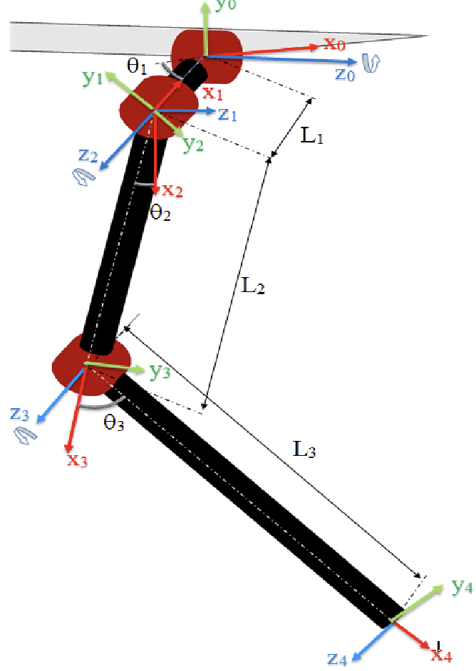

<!-- _class: cover_b -->
<!-- _header: "" -->
<!-- _footer: "" -->
<!-- _paginate: "" -->
<!-- _backgroundImage: url('https://marp.app/assets/hero-background.svg') -->

# Robot Perception and Control

###### Kinematics and Control

Last updated: Jul / 25 /2024
Kashu Yamazaki
kyamazak@andrew.cmu.edu


## Kinematics

<!-- _class: trans -->
<!-- _footer: "" -->
<!-- _paginate: "" -->

## Kinematics

Kinematics: study of a motion of the robot without considering the forces and torques producing the motion.

## Denavit–Hartenberg convention

The following four transformation parameters are known as D–H parameters:

- $a_i$: distance from $z_{i-1}$ to $z_i$ along $x_i$.
- $\alpha_i$: angle from $z_{i-1}$ to $z_i$ about $x_i$.
- $d_i$: distance from $x_{i-1}$ to $x_i$ along $z_i$.
- $\theta_i$: angle from $x_{i-1}$ to $x_i$ about $z_i$.

Usually, $a_i$ and $\alpha_i$ are **constants** that describe the geometry of the robot, while $d_i$ and $\theta_i$ are the **variables** that describe the motion of prismatic and revolute joints, respectively.


## Denavit–Hartenberg convention

In this convention, coordinate frames are attached to the joints between two links such that one transformation is associated with the joint $[Z]$, and the second is associated with the link $[X]$. The coordinate transformations $[T]$ along a serial robot consisting of $n$ links form the kinematics equations of the robot as:

$$
[T] = [Z_1][X_1][Z_2][X_2]...[Z_n][X_n]
$$

where each transformation $[Z][X]$ can be implemented as a $4\times4$ matrix using the DH parameters as:

```python
def transform(a, alpha, d, theta):
    return Rot(theta, axis="z") @ Trans(d, axis="z") @ Trans(a, axis="x") @ Rot(alpha, axis="x")
```

## Forward Kinematics

Forward kinematics is the problem of finding the end-effector position and orientation of a robot manipulator given the joint angles and link lengths.

$$
x(t) = f(\theta(t))
$$

Using the 
```python
```

## Forward Kinematics

The DH parameters for forward kinematics of the leg are given as:

| Link | $\alpha$ | $a$ | $d$ | $\theta$ | 
| --- | --- | --- | --- | --- |
| 0-1 | $0$ | $L_1$ | $0$ | $\theta_1$ | 
| 1-2 | $-\pi/2$ | 0 | 0 | $-\pi/2$ | 
| 2-3 | $0$ | $L_2$ | $0$ | $\theta_2$ | 
| 3-4 | $0$ | $L_3$ | $0$ | $\theta_3$ | 



## Inverse Kinematics

Inverse kinematics (IK) is essentially the reverse operation of FK: computing configuration(s) to reach a desired workspace coordinate. Unlike forward kinematics, inverse kinematics cannot be solved in a closed-form expression (in general). If we can derive a closed-form expression through symbolic manipulations, we can use Analytical IK, otherwise we need to use numerical approach.

**Analytical IK**
- Once the equations are derived, solutions are very fast to compute.
- Often difficult or tedious to derive.
- Only applicable to non-redundant robots (# DOFs = # of task space dimensions).

**Numerical IK**
- need to define solution parameters or initial guesses
- More generalizable

## Analytical Inverse Kinematics


## Analytical Inverse Kinematics

Given the foot position $(x_4, y_4, z_4)$, the joint positions $\theta_1, \theta_2, \theta_3$ for a typical quadruped leg is given as in [paper](https://www.ijstr.org/final-print/sep2017/Inverse-Kinematic-Analysis-Of-A-Quadruped-Robot.pdf):

$$
\theta_1 = -\operatorname{atan2}(-y_4, x_4) - \operatorname{atan2}\left(\sqrt{x_4^2 + y_4^2 - L_1^2}, -L_1\right)
$$

$$
\theta_2 = \operatorname{atan2}\left( z_4, \sqrt{x_4^2 + y_4^2 - L_1^2} \right) - \operatorname{atan2}\left( L_3 \sin(\theta_3), L_2 + L_3 \cos(\theta_3) \right)

$$

$$
\theta_3 = \operatorname{atan2}\left(\pm\sqrt{1-D^2}, D \right)
$$

where

$$
D = \frac{x_4^2+y_4^2+z_4^2-L_1^2-L_2^2-L_3^2}{2L_2L_3}
$$

- the $\pm$ sign in $\theta_3$ determines the knee direction if the quadruped.


## Jacobian

The Jacobian matrix is a matrix of partial derivatives that describes how the robot's configuration affects the robot's end-effector position. The Jacobian matrix is defined as:

$$
J = \frac{\partial x}{\partial \theta}
$$

where $x$ is the end-effector position and $\theta$ is the joint angles.

If we consider the differentiation w. r. t. time, we can write the relationship between $\dot{x}$ and $\dot{\theta}$.

$$
\dot{x} = J(\theta)\dot{\theta}
$$

## Basic Jacobian


## Numerical Inverse Kinematics

Given an initial guess $\theta^0$ that is close to a solution $\theta_d$, the kinematics can be expressed as the Taylor expansion:

$$
\begin{align}
x_d = f(\theta_d) &= f(\theta^0) + \left. \frac{\partial f}{\partial \theta} \right|_{\theta^0} (\theta_d - \theta^0) + \text{h.o.t.} \\
&= f(\theta^0) + J(\theta^0)\Delta\theta + \text{h.o.t.}
\end{align}
$$

where $J(\theta^0)$ is the coordinate Jacobian at $\theta^0$.
By truncating the Taylor expansion at first order, we can obtain the approximation as:

$$
J(\theta^0)\Delta\theta = x_d - f(\theta^0)
$$

Assuming that $J(\theta^0)$ is square and invertible, we can solve for $\Delta\theta$ as:

$$
\Delta\theta = J^{-1}(\theta^0)(x_d - f(\theta^0))
$$

- In practice, **Moore-Penrose pseudo-inverse** of a Jacobian $J^+$ is used and we do not need to assume square and invertible. 

##