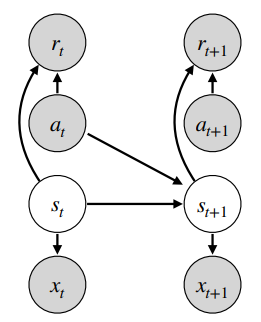

<!-- _class: cover_b -->
<!-- _header: "" -->
<!-- _footer: "" -->
<!-- _paginate: "" -->

# Robot Perception and Control

###### Reinforcement Learning

Last updated: Jul / 25 /2024
Kashu Yamazaki
kyamazak@andrew.cmu.edu

## Application of Reinforcement Learning

<!-- _class: trans -->
<!-- _footer: "" -->
<!-- _paginate: "" -->

## Game Agents


## Alignment of LLMs


## Robot Control


## Basics of Reinforcement Learning

<!-- _class: trans -->
<!-- _footer: "" -->
<!-- _paginate: "" -->

<!-- ## Problem Setup

**Markov decision process (MDP)**


**Partially Observable MDP (POMDP)**

When the agent does not have direct access to the state $s_t$ but can observe the environment via observation $o_t$ that is determined by the previous action $a_{t-1}$ and the state $s_t$. 

## Reward and Return

**Reward** $r_{t+1}$: the evaluation of an action $a_t$ to the state $s_t$.

**Return** $R_t$: the evaluation of future rewards $\{r_{t+1}, r_{t+2}, \dots\}$

We usually apply a discount factor ($0 \leq \gamma \leq 1$) 
$$
R_t = r_{t+1} + \gamma r_{t+2} + \gamma^2 r_{t+3} + \dots = \sum_{k=0}^{\infty}{\gamma^k r_{t+k+1}}
$$ -->


## Expectation
Expectation is the **probability-weighted average** of all possible values.

Let $X$ be a random variable and $f$ be any function.
* For continuous distribution, the expectation of $f(X)$ is:
  $$
  \mathbb{E}[f(X)] = \int_{-\infty}^\infty p(x)f(x)dx
  $$
  where $p$ is the **probability density function** of $X$.

* For discrete distribution, the expectation of $f(X)$ is:
  $$
  \mathbb{E}_{x\sim \mathcal{X}}[f(x)] = \sum_{x\in \mathcal{X}} p(x)f(x)
  $$
  where $p$ is the **probability mass function** of $X$ and $\mathcal{X}$ is the support of $X$.

<!-- where random variable $X$ is in the domain $\mathcal{X}$. -->

## Expectation and Independence

Let $X$ and $Y$ be independent random variables. Then, the two random variables are **mean independent** for any function $g$ and $h$:
$$
\mathbb{E}[g(X)h(Y )] = \mathbb{E}[g(X)]\mathbb{E}[h(Y )]
$$

* Let $X$ and $Y$ be independent random variables. Then, $U = g(X)$ and $V = h(Y )$ are also independent for any function $g$ and $h$.

## Expectation and Inequalities

**Chebychev’s Inequality**: Let $X$ be a random variable and let $g$ be a nonnegative function. Then, for any positive real number $a$, 

  $$
  P(g(X) \geq a) \leq \frac{\mathbb{E}[g(X)]}{a}
  $$
  
  * when $g(X) = |X|$, it is called **Markov’s inequality**.

**Jensen’s Inequality**: Let $X$ be a random variable with $\mathbb{E}(|X|) < \infty$. If $g$ is a **convex** function, then: 

  $$
  \mathbb{E}[g(X)] \geq g(\mathbb{E}[X])
  $$
  * for a concave function, then the inequality will be reversed


## Markov Property (MP)
A stochastic process has the Markov property if the conditional probability distribution of future states of the process (conditional on both past and present values) depends only upon the present state.
Markov property is defined by the following condition:
$$
p(x_{t+1}=j| x_0=i_0, \ldots, x_t=i_t) = p(x_{t+1}=j| x_t=i)
$$

* memoryless property of a stochastic process


## Markov Decision Process (MDP)
A standard discrete-time MDP is defined by a tuple of $(\mathcal{S}, \mathcal{A}, \mathcal{R}, \mathcal{T}, \rho_0)$ where:
* $\mathcal{S}$ is a set of all valid states (state space)
* $\mathcal{A}$ is a set of all valid actions (action space)
* $\mathcal{R}: \mathcal{S}\times \mathcal{A} \times \mathcal{S} \rightarrow \mathbb{R}$ is a reward function with $r_t = \mathcal{R}(s_t, a_t, s_{t+1})$ (or $\mathcal{C}$: task cost function)
* $\mathcal{T}: \mathcal{S}\times \mathcal{A} \rightarrow \mathcal{T}(\mathcal{S})$ is a transition probability function (transition model)
* $\gamma$ is the starting state distribution


## Partially Observable MDP (POMDP)
When all states are observable such that $o_t = s_t$, this can be considered a Markov Decision Process (MDP). When there is unobservable information, such as external forces or full terrain information in robotics, the dynamics are modeled as a Partially Observable Markov Decision Process (POMDP).

$$
\begin{aligned}
&p\left(s_{\leq t}, a_{t} \mid x_{\leq t}, a_{<t}, o_{\geq t}\right) \\
&=p\left(a_{t} \mid s_{t}, o_{\geq t}\right) p\left(s_{1} \mid x_{1}\right) \prod_{\tau=1}^{t} p\left(s_{\tau+1} \mid x_{\tau+1}, s_{\tau}, a_{\tau}\right)
\end{aligned}
$$



<!-- ## Partially Observable MDP (POMDP) -->
This is often overcome by constructing a **belief state** $b_t$ from a history of observations $\{o_0, \dots , o_t\}$ in an attempt to capture the full state. In deep reinforcement learning, this is frequently done by stacking a sequence of previous observations [[1](https://arxiv.org/pdf/1312.5602.pdf)] or by using architectures which can compress past information such as Recurrent Neural Networks (RNNs) or Temporal Convolutional Networks (TCNs).


##  constrained Markov Decision Process (cMDP)

Another challenge is to ensure the safety of the robot during the entire learning process. Safety in RL can be formulated as a constrained Markov Decision Process (cMDP), which can be solved by the **Lagrangian relaxation procedure**.


## Reinforcement Learning


At every step of interaction, the **agent** sees a (possibly partial) observation $o_t$ of the state of the world, and then decides on an action $a_t$ to take based on a policy $\pi$. The environment changes when the agent acts on it, but may also change on its own. The state usually follows a discrete-time **Markov Decision Process (MDP)**.

<!-- An agent percieves state $s_t$ and selects action $a_t$ based on a policy $\pi(a|s)$. Then the agent receives a reward $r_t = r(s_t, a_t)$ and the next state $s_{t+1}$.  -->

Objective of the agent is to learn a policy $\pi$ that maximizes the **return** (or **total discounted reward**) or the objective function related to the return.
<!-- $$
\begin{split}
G_t &= \sum_{k=0}^{T-t-1}\gamma^k r_{t+k+1} = r_{t+1} + \gamma r_{t+2} +\dots+ \gamma^{T-t-1} r_{T} \\
&= r_{t+1} + \gamma G_{t+1}
\end{split}
$$ -->


## States and Action Space
The environment is **fully observable** when the agent is able to observe the complete state of the environment. The environment is **partially observable** when the agent is able to observe only a partial state of the environment. We highlight the difference of state and observation as:

**state** ($s$): a complete description of the state of the world.
**observation** ($o$): a partial description of a state, which may omit information.

The set of all valid actions in a given environment is often called the action space. 
Mainly, action space is either **discrete action spaces** (e.g., Atari and Go) or **continuous action spaces** (e.g., Robot control).


## Policies 
A policy is a rule used by an agent to decide what actions to take. It can be deterministic ($a_t=\mu(s_t)$) or stochastic ($a_t\sim\pi(\cdot|\mathcal{S}=s_t)$).

**Deterministic Policies**: a function that maps the set of states of the environment $\mathcal{S}$ to the set of actions $\mathcal{A}$.

**Stochastic Policies**: can be represented as a *family* of conditional probability distributions. For a fixed state $s\in\mathcal{S}$, $\pi(\mathcal{A}∣\mathcal{S}=s)$ is a possibly distinct conditional probability distribution. 
* **categorical policies** can be used in discrete action spaces.
* **diagonal Gaussian policies** are used in continuous action spaces.


## Categorical Policies
A categorical policy is like a classifier over discrete actions that returns softmax probabilities of each action.

* Sampling: given the probabilities for each action, an action can be sampled via: `torch.multinomial` or `sample()` method of `Categorical` distribution in Pytorch. 

* Log-Likelihood: denote the last layer of probabilities as $P_{\theta}(s)$. We can treat the actions as indices for $P_{\theta}(s)$. The log likelihood for an action a can then be obtained by indexing into the vector:
  $$
  \log \pi_\theta(a|s) = \log [P_{\theta}(s)]_a
  $$

## Diagonal Gaussian Policies
A multivariate Gaussian distribution is described by a mean vector $\mu$ and a covariance matrix $\Sigma$. A diagonal Gaussian distribution is a special case where the covariance matrix only has entries on the diagonal. As a result, we can represent it by a vector.

**mean vector**: A diagonal Gaussian policy always has a neural network that maps from observations to mean actions $\mu_{\theta}(s)$. 
**covariance matrix**: typically represented as standalone parameters $\log \sigma$ or a neural network that maps from states to log standard deviations $\log \sigma_{\theta}(s)$, which may optionally share some layers with the mean network. 
  > Note that in both cases of covariance matrix, log standard deviations is used instead of standard deviations directly. This is because log stds are free to take on any values in $(-\infty, \infty)$, while stds must be nonnegative.


## Diagonal Gaussian Policies

* Sampling: given the mean action $\mu_{\theta}(s)$ and standard deviation $\sigma_{\theta}(s)$, and a vector $z$ of noise from a spherical Gaussian $(z \sim \mathcal{N}(0, I))$, an action sample can be computed with $a = \mu_{\theta}(s) + \sigma_{\theta}(s) \odot z$. Can be done by using `rsample()` method in `Normal` distribution in Pytorch. 

* Log-Likelihood: the log-likelihood of a $k$-dimensional action $a$, for a diagonal Gaussian with mean $\mu = \mu_{\theta}(s)$ and standard deviation $\sigma = \sigma_{\theta}(s)$, is given by:
  $$
  \log \pi_{\theta}(a | s)=-\frac{1}{2}\left(\sum_{i=1}^{k}\left(\frac{\left(a_{i}-\mu_{i}\right)^{2}}{\sigma_{i}^{2}}+2 \log \sigma_{i}\right)+k \log 2 \pi\right)
  $$


## Gradient Estimation
It is not possible to directly backpropagate through random samples. There are two main methods for creating surrogate functions that allows backpropagation through random samples [[1](https://arxiv.org/pdf/1506.05254.pdf)].  

**Score function estimator** (likelihood ratio estimator/ REINFORCE): the partial derivative of the log-likelihood function commonly seen as the basis for policy gradient methods. When the probability density function is differentiable with respect to its parameters, we only need `sample()` and `log_prob()` methods.
<!-- ```python
probs = policy_network(state)
m = torch.distributions.categorical.Categorical(probs) # p(a|\pi(s))
action = m.sample()
next_state, reward = env.step(action)
loss = -m.log_prob(action) * reward
loss.backward()
``` -->

**Pathwise derivative estimator**: commonly seen in the reparameterization trick in variational autoencoders. The parameterized random variable can be constructed via a parameterized deterministic function of a parameter-free random variable. Can be done by using `rsample()` method. 


## Trajectories
A trajectory $\tau$ is a sequence of states and actions in the world:
$$
\tau = (s_0, a_0, s_1, a_1, \dots) \sim (\pi_\theta, P(s_{t+1}|s_t, a_t))
$$
where the first state of the world, $s_0$, is randomly sampled from the start-state distribution $s_0 \sim \rho_0(\cdot)$. 
> Trajectories are also frequently called **episodes** or **rollouts**.

State transitions (what happens to the world between the state at time $t$, $s_t$, and the state at $t+1$, $s_{t+1}$), are governed by the natural laws of the environment, and depend on only the most recent action, $a_t$. They can be either deterministic $s_{t+1} = f(s_t, a_t)$ or stochastic $s_{t+1} \sim P(\cdot | s_t, a_t)$. 


## Reward and Return
The reward function $R$ depends on the current state of the world, the action just taken, and the next state of the world $r_t = R(s_t, a_t, s_{t+1})$. The goal of the agent is to maximize some notion of cumulative reward over a trajectory $R(\tau)$. 

**finite-horizon undiscounted return**: the sum of rewards obtained in a fixed window of steps.
$$
R(\tau) = \sum_{k=1}^{T} r_{t+k}
$$

**infinite-horizon discounted return**: the sum of all rewards ever obtained by the agent, but discounted by how far off in the future they’re obtained.
$$
G_t = R(\tau) = \sum_{k=0}^{\infty} \gamma^k r_{t+k+1}
$$

we can also represent this in a recursive way:
$$
G_t = r_{t+1}+ \gamma(r_{t+2}+\gamma r_{t+3} \dots) = r_{t+1}+ \gamma G_{t+1}
$$

## Reinforcement Learning

Suppose that both the environment transitions and the policy are stochastic. In this case, the probability of a $T$-step trajectory is:

$$
P(\tau | \pi) = \rho_0(s_0) \prod_{t=0}^{T-1} P(s_{t=1}| s_t, a_t)\pi(a_t | s_t)
$$
The expected return, denoted by $J(\pi)$, is then:
$$
J(\pi) = \int_\tau P(\tau | \pi) R(\tau) d\tau = \mathbb{E}_{\tau}[R(\tau)]
$$

The central optimization problem in RL is to find the policy $\pi$ that maximizes the expected return $J(\pi)$:
$$
\pi^* = \arg\max_\pi J(\pi)
$$

## Model-Free Reinforcement Learning

<!-- _class: trans -->
<!-- _footer: "" -->
<!-- _paginate: "" -->


## Model-Free Reinforcement Learning

**Value-based methods**: methods in this family learn an approximator $Q_\theta(s,a)$.
* Typically use an objective function based on the **Bellman equation**.
* optimization is almost always performed **off-policy**: each update can use data collected at any point during training (substantially more sample efficient).

**Policy-based methods**: methods in this family represent a policy explicitly as $\pi_\theta(a|s)$.
* usually involves learning an approximator $V_\phi(s)$.
* optimization is almost always performed **on-policy**: each update only uses data collected while acting according to the most recent policy.