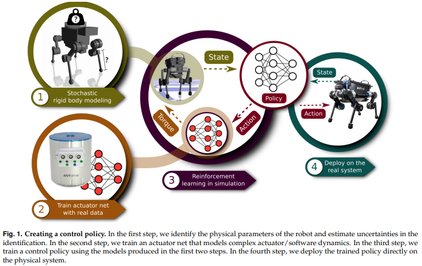
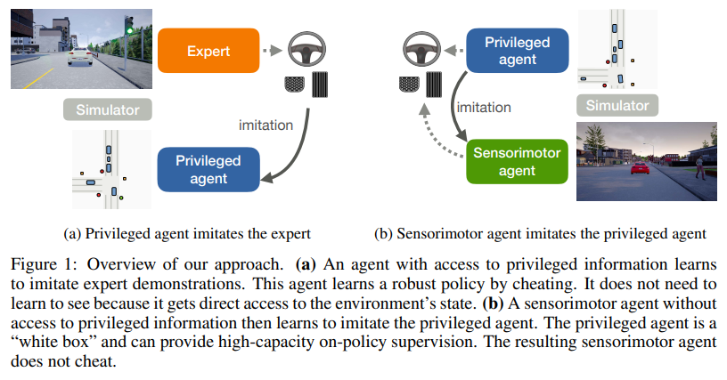
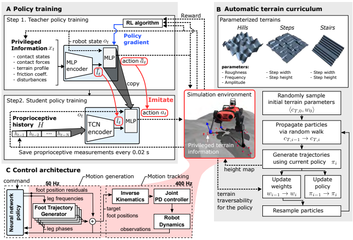
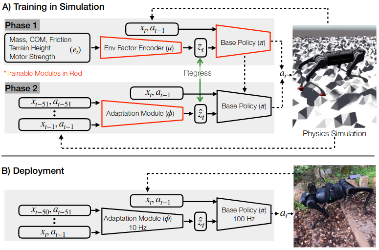
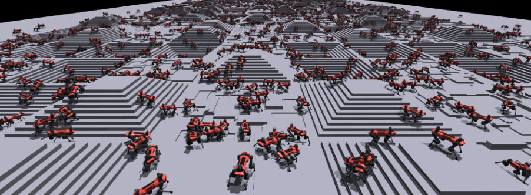
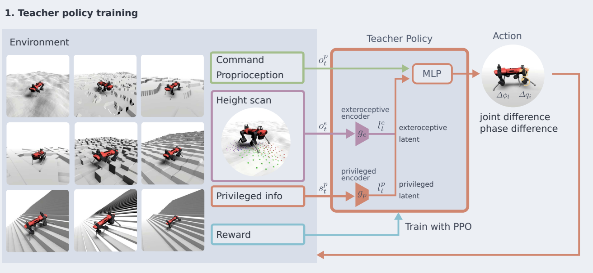
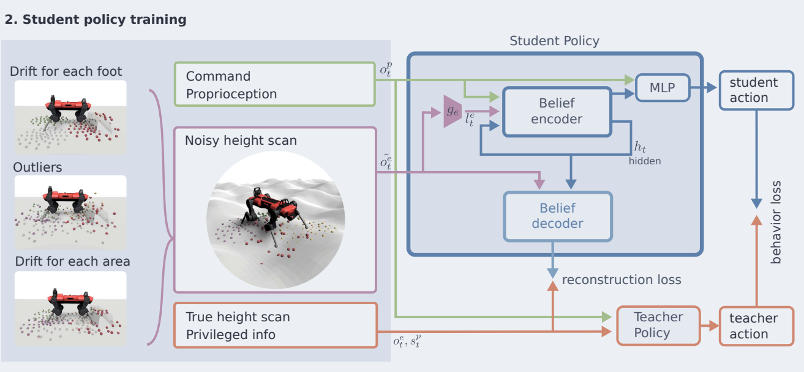
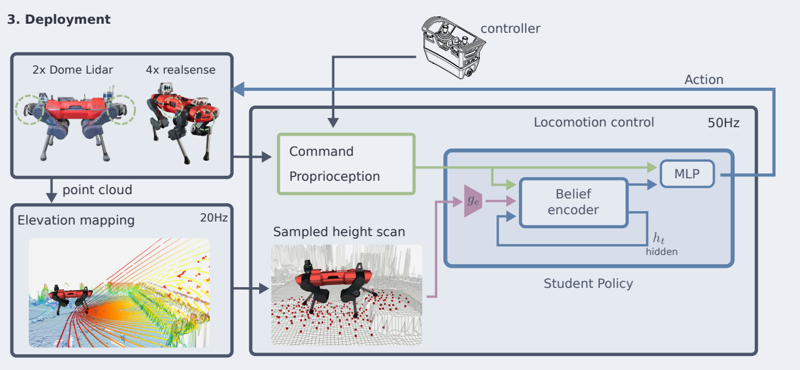
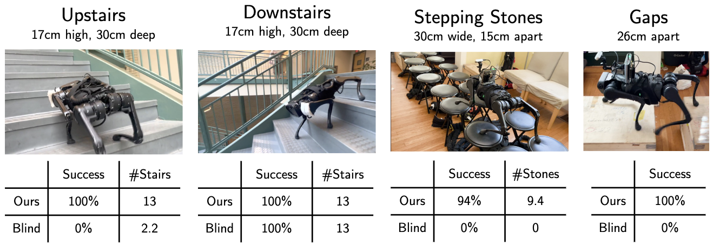
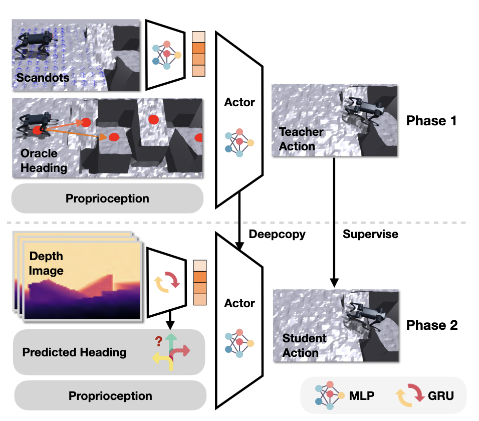

<!-- _class: cover_b -->
<!-- _header: "" -->
<!-- _footer: "" -->
<!-- _paginate: "" -->
<!-- _backgroundImage: url('https://marp.app/assets/hero-background.svg') -->

# Robot Perception and Control

###### Legged Locomotion

Last updated: Jul / 25 /2024
Kashu Yamazaki
kyamazak@andrew.cmu.edu

## What can we do with RL $\times$ Legged Robots?

<!-- _class: cols-2 -->

## Actuator Networks　[arxiv](https://arxiv.org/abs/1901.08652)
<!-- _class: cols-2 -->

Actuators are extremely difficult to model accurately. 
- *nonlinear* and *non-smooth* dissipation in dynamics.
- contains cascaded feedback loops and a number of internal states that are not even directly observable.

Actuator Networks is a **data driven** solution that can provide better simulation of an actuator via supervised learning.

- learns **action-to-torque** relationship that includes all software and hardware dynamics.
- actuator network estimated torque at the joints given a history of position errors and velocities.

> collect *joint position errors*, *velocities*, and *torque* using a controller for more than a million samples with varied amplitude and frequency and manual disturbances for diverse situation.

## Learning by Cheating [arxiv](https://arxiv.org/abs/1912.12294) [github](https://github.com/dotchen/LearningByCheating)

Proposed two-stage training procedure, which first train a privileged agent and then using the agent as a teacher to train a purely vision-based system, for effective imitation learning. This paradigm is the underlying concept in the legged RL.

## Learning Locomotion over Challenging Terrain [arxiv](https://arxiv.org/abs/2010.11251) [github](https://github.com/leggedrobotics/learning_quadrupedal_locomotion_over_challenging_terrain_supplementary)

<!-- _class: cols-2 -->

## RMA: Rapid Motor Adaptation [paper](https://ashish-kmr.github.io/rma-legged-robots/rma-locomotion-final.pdf)

<!-- _class: cols-2 -->

## Learning to Walk in Minutes [arvix](https://arxiv.org/abs/2109.11978) [github](https://github.com/leggedrobotics/legged_gym)

Presents a training setup that achieves fast policy generation for real-world robotic tasks by using massive parallelism on a single workstation GPU (showcase of Isaac Gym).

- A codebase is widely used as baseline for developing legged locomotion system.

## Walk These Ways [arxiv](https://arxiv.org/abs/2212.03238)

## Perceptive locomotion

<!-- _class: trans -->
<!-- _footer: "" -->
<!-- _paginate: "" -->

## Perceptive locomotion for quadrupeds
Presented a three stage training and deploy method to perform zero-shot sim-to-real transfer [[1](https://arxiv.org/pdf/2201.08117.pdf)]. 
1. a **teacher policy**, which has access to privileged information, is trained to follow a random target velocity over randomly generated terrain with random disturbances.
1. a **student policy** is trained to reproduce the teacher policy’s actions without using this privileged information.
1. transfer the learned student policy to the physical robot and deploy it in the real world with onboard sensors.

## Training teacher policy

## Training student policy

## Deployment

## Legged Locomotion using Egocentric Vision [arxiv](https://arxiv.org/abs/2211.07638) 

## Parkour Learning [arxiv](https://arxiv.org/abs/2309.05665)

## Extreme Parkour [arxiv](https://arxiv.org/abs/2309.14341)

<!-- _class: cols-2 -->

## Humanoid Parkour Learning [arxiv](https://arxiv.org/abs/2406.10759v1)