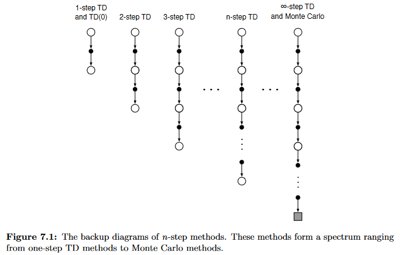

<!-- _class: cover_b -->
<!-- _header: "" -->
<!-- _footer: "" -->
<!-- _paginate: "" -->
<!-- _backgroundImage: url('https://marp.app/assets/hero-background.svg') -->

# Robot Perception and Control

###### Reinforcement Learning

Last updated: Jul / 25 /2024
Kashu Yamazaki
kyamazak@andrew.cmu.edu

## Application of Reinforcement Learning

<!-- _class: trans -->
<!-- _footer: "" -->
<!-- _paginate: "" -->

## Game Agents


## Alignment of LLMs


## Robot Control

<!-- _class: cols-2 -->

<div class=ldiv>


</div>

<div class=rdiv>


</div>


## Basics of Reinforcement Learning

<!-- _class: trans -->
<!-- _footer: "" -->
<!-- _paginate: "" -->

<!-- ## Problem Setup

**Markov decision process (MDP)**


**Partially Observable MDP (POMDP)**

When the agent does not have direct access to the state $s_t$ but can observe the environment via observation $o_t$ that is determined by the previous action $a_{t-1}$ and the state $s_t$. 

## Reward and Return

**Reward** $r_{t+1}$: the evaluation of an action $a_t$ to the state $s_t$.

**Return** $R_t$: the evaluation of future rewards $\{r_{t+1}, r_{t+2}, \dots\}$

We usually apply a discount factor ($0 \leq \gamma \leq 1$) 
$$
R_t = r_{t+1} + \gamma r_{t+2} + \gamma^2 r_{t+3} + \dots = \sum_{k=0}^{\infty}{\gamma^k r_{t+k+1}}
$$ -->


## Expectation
Expectation is the **probability-weighted average** of all possible values.

Let $X$ be a random variable and $f$ be any function.
* For continuous distribution, the expectation of $f(X)$ is:
  $$
  \mathbb{E}[f(X)] = \int_{-\infty}^\infty p(x)f(x)dx
  $$
  where $p$ is the **probability density function** of $X$.

* For discrete distribution, the expectation of $f(X)$ is:
  $$
  \mathbb{E}_{x\sim \mathcal{X}}[f(x)] = \sum_{x\in \mathcal{X}} p(x)f(x)
  $$
  where $p$ is the **probability mass function** of $X$ and $\mathcal{X}$ is the support of $X$.

<!-- where random variable $X$ is in the domain $\mathcal{X}$. -->

## Expectation and Independence

Let $X$ and $Y$ be independent random variables. Then, the two random variables are **mean independent** for any function $g$ and $h$:
$$
\mathbb{E}[g(X)h(Y )] = \mathbb{E}[g(X)]\mathbb{E}[h(Y )]
$$

* Let $X$ and $Y$ be independent random variables. Then, $U = g(X)$ and $V = h(Y )$ are also independent for any function $g$ and $h$.

## Expectation and Inequalities

**Chebychev’s Inequality**: Let $X$ be a random variable and let $g$ be a nonnegative function. Then, for any positive real number $a$, 

  $$
  P(g(X) \geq a) \leq \frac{\mathbb{E}[g(X)]}{a}
  $$
  
  * when $g(X) = |X|$, it is called **Markov’s inequality**.

**Jensen’s Inequality**: Let $X$ be a random variable with $\mathbb{E}(|X|) < \infty$. If $g$ is a **convex** function, then: 

  $$
  \mathbb{E}[g(X)] \geq g(\mathbb{E}[X])
  $$
  * for a concave function, then the inequality will be reversed


## Markov Property (MP)
A stochastic process has the Markov property if the conditional probability distribution of future states of the process (conditional on both past and present values) depends only upon the present state.
Markov property is defined by the following condition:
$$
p(x_{t+1}=j| x_0=i_0, \ldots, x_t=i_t) = p(x_{t+1}=j| x_t=i)
$$

* memoryless property of a stochastic process


## Markov Decision Process (MDP)
A standard discrete-time MDP is defined by a tuple of $(\mathcal{S}, \mathcal{A}, \mathcal{R}, \mathcal{T}, \rho_0)$ where:
* $\mathcal{S}$ is a set of all valid states (state space)
* $\mathcal{A}$ is a set of all valid actions (action space)
* $\mathcal{R}: \mathcal{S}\times \mathcal{A} \times \mathcal{S} \rightarrow \mathbb{R}$ is a reward function with $r_t = \mathcal{R}(s_t, a_t, s_{t+1})$ (or $\mathcal{C}$: task cost function)
* $\mathcal{T}: \mathcal{S}\times \mathcal{A} \rightarrow \mathcal{T}(\mathcal{S})$ is a transition probability function (transition model)
* $\gamma$ is the starting state distribution


## Partially Observable MDP (POMDP)
When all states are observable such that $o_t = s_t$, this can be considered a Markov Decision Process (MDP). When there is unobservable information, such as external forces or full terrain information in robotics, the dynamics are modeled as a Partially Observable Markov Decision Process (POMDP).

$$
\begin{aligned}
&p\left(s_{\leq t}, a_{t} \mid x_{\leq t}, a_{<t}, o_{\geq t}\right) \\
&=p\left(a_{t} \mid s_{t}, o_{\geq t}\right) p\left(s_{1} \mid x_{1}\right) \prod_{\tau=1}^{t} p\left(s_{\tau+1} \mid x_{\tau+1}, s_{\tau}, a_{\tau}\right)
\end{aligned}
$$


<!-- ## Partially Observable MDP (POMDP) -->
This is often overcome by constructing a **belief state** $b_t$ from a history of observations $\{o_0, \dots , o_t\}$ in an attempt to capture the full state. In deep reinforcement learning, this is frequently done by stacking a sequence of previous observations [[1](https://arxiv.org/pdf/1312.5602.pdf)] or by using architectures which can compress past information such as Recurrent Neural Networks (RNNs) or Temporal Convolutional Networks (TCNs).


##  constrained Markov Decision Process (cMDP)

Another challenge is to ensure the safety of the robot during the entire learning process. Safety in RL can be formulated as a constrained Markov Decision Process (cMDP), which can be solved by the **Lagrangian relaxation procedure**.


## Reinforcement Learning


At every step of interaction, the **agent** sees a (possibly partial) observation $o_t$ of the state of the world, and then decides on an action $a_t$ to take based on a policy $\pi$. The environment changes when the agent acts on it, but may also change on its own. The state usually follows a discrete-time **Markov Decision Process (MDP)**.

<!-- An agent percieves state $s_t$ and selects action $a_t$ based on a policy $\pi(a|s)$. Then the agent receives a reward $r_t = r(s_t, a_t)$ and the next state $s_{t+1}$.  -->

Objective of the agent is to learn a policy $\pi$ that maximizes the **return** (or **total discounted reward**) or the objective function related to the return.
<!-- $$
\begin{split}
G_t &= \sum_{k=0}^{T-t-1}\gamma^k r_{t+k+1} = r_{t+1} + \gamma r_{t+2} +\dots+ \gamma^{T-t-1} r_{T} \\
&= r_{t+1} + \gamma G_{t+1}
\end{split}
$$ -->


## States and Action Space
The environment is **fully observable** when the agent is able to observe the complete state of the environment. The environment is **partially observable** when the agent is able to observe only a partial state of the environment. We highlight the difference of state and observation as:

**state** ($s$): a complete description of the state of the world.
**observation** ($o$): a partial description of a state, which may omit information.

The set of all valid actions in a given environment is often called the action space. 
Mainly, action space is either **discrete action spaces** (e.g., Atari and Go) or **continuous action spaces** (e.g., Robot control).


## Policies 
A policy is a rule used by an agent to decide what actions to take. It can be deterministic ($a_t=\mu(s_t)$) or stochastic ($a_t\sim\pi(\cdot|\mathcal{S}=s_t)$).

**Deterministic Policies**: a function that maps the set of states of the environment $\mathcal{S}$ to the set of actions $\mathcal{A}$.

**Stochastic Policies**: can be represented as a *family* of conditional probability distributions. For a fixed state $s\in\mathcal{S}$, $\pi(\mathcal{A}∣\mathcal{S}=s)$ is a possibly distinct conditional probability distribution. 
* **categorical policies** can be used in discrete action spaces.
* **diagonal Gaussian policies** are used in continuous action spaces.


## Categorical Policies
A categorical policy is like a classifier over discrete actions that returns softmax probabilities of each action.

* Sampling: given the probabilities for each action, an action can be sampled via: `torch.multinomial` or `sample()` method of `Categorical` distribution in Pytorch. 

* Log-Likelihood: denote the last layer of probabilities as $P_{\theta}(s)$. We can treat the actions as indices for $P_{\theta}(s)$. The log likelihood for an action a can then be obtained by indexing into the vector:
  $$
  \log \pi_\theta(a|s) = \log [P_{\theta}(s)]_a
  $$

## Diagonal Gaussian Policies
A multivariate Gaussian distribution is described by a mean vector $\mu$ and a covariance matrix $\Sigma$. A diagonal Gaussian distribution is a special case where the covariance matrix only has entries on the diagonal. As a result, we can represent it by a vector.

**mean vector**: A diagonal Gaussian policy always has a neural network that maps from observations to mean actions $\mu_{\theta}(s)$. 
**covariance matrix**: typically represented as standalone parameters $\log \sigma$ or a neural network that maps from states to log standard deviations $\log \sigma_{\theta}(s)$, which may optionally share some layers with the mean network. 
  > Note that in both cases of covariance matrix, log standard deviations is used instead of standard deviations directly. This is because log stds are free to take on any values in $(-\infty, \infty)$, while stds must be nonnegative.


## Diagonal Gaussian Policies

* Sampling: given the mean action $\mu_{\theta}(s)$ and standard deviation $\sigma_{\theta}(s)$, and a vector $z$ of noise from a spherical Gaussian $(z \sim \mathcal{N}(0, I))$, an action sample can be computed with $a = \mu_{\theta}(s) + \sigma_{\theta}(s) \odot z$. Can be done by using `rsample()` method in `Normal` distribution in Pytorch. 

* Log-Likelihood: the log-likelihood of a $k$-dimensional action $a$, for a diagonal Gaussian with mean $\mu = \mu_{\theta}(s)$ and standard deviation $\sigma = \sigma_{\theta}(s)$, is given by:
  $$
  \log \pi_{\theta}(a | s)=-\frac{1}{2}\left(\sum_{i=1}^{k}\left(\frac{\left(a_{i}-\mu_{i}\right)^{2}}{\sigma_{i}^{2}}+2 \log \sigma_{i}\right)+k \log 2 \pi\right)
  $$


## Gradient Estimation
It is not possible to directly backpropagate through random samples. There are two main methods for creating surrogate functions that allows backpropagation through random samples [[1](https://arxiv.org/pdf/1506.05254.pdf)].  

**Score function estimator** (likelihood ratio estimator/ REINFORCE): the partial derivative of the log-likelihood function commonly seen as the basis for policy gradient methods. When the probability density function is differentiable with respect to its parameters, we only need `sample()` and `log_prob()` methods.
<!-- ```python
probs = policy_network(state)
m = torch.distributions.categorical.Categorical(probs) # p(a|\pi(s))
action = m.sample()
next_state, reward = env.step(action)
loss = -m.log_prob(action) * reward
loss.backward()
``` -->

**Pathwise derivative estimator**: commonly seen in the reparameterization trick in variational autoencoders. The parameterized random variable can be constructed via a parameterized deterministic function of a parameter-free random variable. Can be done by using `rsample()` method. 


## Trajectories
A trajectory $\tau$ is a sequence of states and actions in the world:
$$
\tau = (s_0, a_0, s_1, a_1, \dots) \sim (\pi_\theta, P(s_{t+1}|s_t, a_t))
$$
where the first state of the world, $s_0$, is randomly sampled from the start-state distribution $s_0 \sim \rho_0(\cdot)$. 
> Trajectories are also frequently called **episodes** or **rollouts**.

State transitions (what happens to the world between the state at time $t$, $s_t$, and the state at $t+1$, $s_{t+1}$), are governed by the natural laws of the environment, and depend on only the most recent action, $a_t$. They can be either deterministic $s_{t+1} = f(s_t, a_t)$ or stochastic $s_{t+1} \sim P(\cdot | s_t, a_t)$. 


## Reward and Return
The reward function $R$ depends on the current state of the world, the action just taken, and the next state of the world $r_t = R(s_t, a_t, s_{t+1})$. The goal of the agent is to maximize some notion of cumulative reward over a trajectory $R(\tau)$. 

**finite-horizon undiscounted return**: the sum of rewards obtained in a fixed window of steps.
$$
R(\tau) = \sum_{k=1}^{T} r_{t+k}
$$

**infinite-horizon discounted return**: the sum of all rewards ever obtained by the agent, but discounted by how far off in the future they’re obtained.
$$
G_t = R(\tau) = \sum_{k=0}^{\infty} \gamma^k r_{t+k+1}
$$

we can also represent this in a recursive way:
$$
G_t = r_{t+1}+ \gamma(r_{t+2}+\gamma r_{t+3} \dots) = r_{t+1}+ \gamma G_{t+1}
$$

## Reinforcement Learning

Suppose that both the environment transitions and the policy are stochastic. In this case, the probability of a $T$-step trajectory is:

$$
P(\tau | \pi) = \rho_0(s_0) \prod_{t=0}^{T-1} P(s_{t=1}| s_t, a_t)\pi(a_t | s_t)
$$
The expected return, denoted by $J(\pi)$, is then:
$$
J(\pi) = \int_\tau P(\tau | \pi) R(\tau) d\tau = \mathbb{E}_{\tau}[R(\tau)]
$$

The central optimization problem in RL is to find the policy $\pi$ that maximizes the expected return $J(\pi)$:
$$
\pi^* = \arg\max_\pi J(\pi)
$$

## Model-free vs Model-based RL
The difference between model-free and model-based RL is whether the agent has access to (or learns) **a model of the environment**. A model is usually a function that predicts state transitions or rewards.

With collected data $\mathcal{D} = \{s_t, a_t, r_{t+1}, s_{t+1}\}_{t=0}^{T}$, problem setup is:

**Model-free**: learn policy directly or indirectly from data ($\mathcal{D} \rightarrow \pi$)

**Model-base**: learn model, then use it to learn or improve a policy ($\mathcal{D} \rightarrow f \rightarrow \pi$)
* substantial improvement in sample efficiency.
* ground-truth model of the environment is usually not available to the agent.

## Model-Free Reinforcement Learning

<!-- _class: trans -->
<!-- _footer: "" -->
<!-- _paginate: "" -->


## Model-Free Reinforcement Learning

**Value-based methods**: methods in this family learn an approximator $Q_\theta(s,a)$.
* Typically use an objective function based on the **Bellman equation**.
* optimization is almost always performed **off-policy**: each update can use data collected at any point during training (substantially more sample efficient).

**Policy-based methods**: methods in this family represent a policy explicitly as $\pi_\theta(a|s)$.
* usually involves learning an approximator $V_\phi(s)$.
* optimization is almost always performed **on-policy**: each update only uses data collected while acting according to the most recent policy.

## Value-based methods

<!-- _footer: "" -->
<!-- _paginate: "" -->

## Value Functions

**Action Value function** $Q^\pi(s, a)$: expected value of the return that can be obtained when selecting action $a$ according to a policy $\pi$ from state $s$.  
<!-- $$
Q^\pi(s_t, a_t) = r_t + \mathbb{E}_{\pi}\left[\sum_{k=1}^{\infty} r\left(s_{t+k}, a_{t+k}\right)\right]
$$ -->

$$
Q^\pi(s, a) =  \mathbb{E}_{\tau \sim \pi}[R(\tau) | s_0=s, a_0=a]
$$
* $Q^\pi$ evaluates how good it is for an agent to pick action $a$ while being in state $s$.

**(State) Value function** $V^\pi(s)$: expected value of the return that can be obtained when acting according to a policy $\pi$ from state $s$.
<!-- $$
V^\pi(s_t) = \mathbb{E}_{\pi}\left[\sum_{k=0}^{\infty} r\left(s_{t+k}, a_{t+k}\right)\right] = \mathbb{E}_\pi\left[Q^\pi(s_t, a_t)\right]
$$ -->

$$
V^\pi(s) =  \mathbb{E}_{a\sim \pi}[Q^\pi(s, a)] 
% = \sum_a \pi(a|s)Q^\pi(s, a)
$$
*  For fixed policy $\pi$,  $V^\pi(s)$ evaluates how good the situation is in state $s$.
* $\mathbb{E}_{s\sim S}[V^\pi(s)]$ evaluates how good the policy $\pi$ is.


## Optimal Value Functions

**Optimal Action-Value Function** $Q^*(s, a)$: expected value of the return that can be obtained when selecting action $a$ according to an optimal policy $\pi$ from state $s$.  
$$
\begin{aligned}
% Q^{*}\left(s_{t}, a_{t}\right) &=r_t +\max _{a} \sum_{k=1}^{\infty} r\left(s_{t+k}, a_{t+k}\right) \\
Q^{*}\left(s, a\right) = \max _{\pi} Q^{\pi}\left(s, a\right)
\end{aligned}
$$

* $Q^{*}$ evaluates how good it is for an agent to pick action $a$ while being in state $s$ no matter what the policy is.

**Optimal (State) Value function** $V^*(s)$: expected value of the return that can be obtained when acting according to an optimal policy $\pi$ from state $s$.

$$
\begin{aligned}
% V^{*}(s_{t}) &= \max _{a} \sum_{k=0}^{\infty} r\left(s_{t+k}, a_{t+k}\right) \\
V^{*}(s) =\max _{\pi} V^{\pi}\left(s\right) = \max _{a} Q^{*}\left(s, a\right) 

\end{aligned}
$$

## Advantage Functions
<!-- To know the relative advantage of the action than others on average. -->

The advantage function $A^{\pi}(s,a)$ corresponding to a policy $\pi$ describes how much better it is to take a specific action $a$ in state $s$, over randomly selecting an action according to $\pi(\cdot|s)$, assuming you act according to $\pi$ forever after. The advantage function is defined by:

$$
\begin{split}
A^{\pi}(s, a) & = Q^{\pi}(s, a) - \mathbb{E}_{\pi}\left[Q^{\pi}(s, a)\right]\\
& = Q^{\pi}(s, a) - V^{\pi}(s)
\end{split}
$$

* the advantage function is crucially important to policy gradient methods.
* note that $\mathbb{E}_{a\sim\pi}[A^{\pi}(s, a)] = 0$.


## The Optimal Q-Function and the Optimal Action

By definition, $Q^*(s,a)$ gives the expected return for starting in state $s$, taking (arbitrary) action $a$, and then acting according to the optimal policy forever after. 
The optimal policy in $s$ will select whichever action maximizes the expected return from starting in $s$. As a result, if we have $Q^*$, we can directly obtain the optimal action, $a^*(s)$, via:

$$
a^* = \arg\max_a Q^*(s, a)
$$

Value-based methods learn an approximator $Q_{\theta}(s,a)$ for the optimal action-value function $Q^*(s, a)$ and the actions taken by the agent are given by:
$$
a = \arg\max_a Q_\theta(s, a)
$$

## What is a good policy?

**greedy policy**: if the optimal action-value function is known, this is the optimal policy.
$$
a = \mu(s) = \arg\max_a Q(s, a)
$$

**$\epsilon$-greedy policy**: a stochastic policy that selects an random action with probability $\epsilon$ and the action with the highest expected return otherwise.
$$
a \sim \pi(a|s) = \begin{cases}
1 - \epsilon & (\arg\max_a Q(s, a))\\ 
\epsilon & \text{ (otherwise) }  
\end{cases}
$$

**Boltzmann policy (softmax policy)**: a policy that samples actions according to a Boltzmann distribution (also called Gibbs distribution):
$$
a\sim\pi(a|s) = \frac{\exp(Q(s, a)/T)}{\sum_{a' \in \mathcal{A}} \exp(Q(s, a')/T)}
$$

* When $T\rightarrow0$, the Boltzmann policy becomes a greedy policy.

## Bellman Equation

All four of the value functions obey special self-consistency equations called **Bellman equations**. An intuition behind Bellman equation is:
> The value of your starting point is the reward you expect to get from being there, plus the value of wherever you land next.

The Bellman equations for the on-policy value functions are:
$$
\begin{aligned}
&Q^{\pi}\left(s, a\right)= \mathbb{E}_{s'\sim P} \left[R\left(s, a, s'\right)+\gamma \mathbb{E}_{a'\sim \pi}\left[Q^{\pi}\left(s', a'\right) \right]\right]\\
&V^{\pi}\left(s\right)=\mathbb{E}_{a\sim \pi}\left[\mathbb{E}_{s'\sim P} \left[R\left(s, a, s'\right)+\gamma V^{\pi}\left(s'\right)\right]\right]
\end{aligned}
$$

The Bellman equations for the optimal value functions are:
$$
\begin{aligned}
&Q^{*}\left(s, a\right)= \mathbb{E}_{s'\sim P} \left[R\left(s, a, s'\right)+\gamma \max_{a'}Q^{*}\left(s', a'\right) \right]\\
&V^{*}\left(s\right)=\max_a\mathbb{E}_{s'\sim P} \left[R\left(s, a, s'\right)+\gamma V^{*}\left(s'\right)\right]
\end{aligned}
$$

## Optimal Value Functions
The backup diagrams below show graphically the spans of future states and actions considered in the Bellman optimality equations for $V^*$ and $Q^*$.


The arcs at the agent’s choice points represent that the maximum over that choice is taken rather than the expected value given some policy.

## Temporal Difference (TD) Learning
A method to update estimated action value function with obtained experience $\{s_t, a_t, r_t, s_{t+1}\}$ at time $t$:

$$
\begin{split}
\hat{Q}^\pi(s_t, a_t) &\leftarrow \hat{Q}^\pi(s_t, a_t) + \alpha \delta_t\\
\delta_t &= y_t - \hat{Q}^\pi(s_t, a_t)
\end{split}
$$

**TD Error** ($\delta_t$): the difference of the expected return between time $t$ and time $t+1$.
**TD Target** ($y_t$): the teacher signal in TD learning.
* **SARSA** (on-policy TD control): $y_t = r_{t+1} + \gamma \hat{Q}^\pi(s_{t+1}, a_{t+1})$
* **Q-Learning** (off-policy TD control) [[1](https://link.springer.com/article/10.1007/BF00992698)]: $y_t = r_{t+1} + \gamma \max_a \hat{Q}^\pi(s_{t+1}, a)$

## TD ($\lambda$)

**forward view**: use future experience to update the current value function. Note that there will be a delay in update of value to obtain the future experience.
* **n-step (truncated) return**: utilization of multi-step experience to obtain target
  $$
  \begin{split}
  (\text{n-step}) \quad y_{t:t+n} &= r_{t+1} + \gamma r_{t+2} + \cdots + \gamma^{n-1}r_{t+n} + \gamma^{n} \hat{V}(s_{t+n})\\
  (\text{episode end}) \quad y_{t:t+T} &= r_{t+1} + \gamma r_{t+2} + \cdots + \gamma^{T-1} r_{t+T}
  \end{split}
  $$

* **$\lambda$-return**: any average of n-step returns can be used as target
  $$
  y_t^\lambda = (1-\lambda) \sum_{n=1}^{T-t}\lambda^{n-1} y_{t:t+n}
  $$

  * **TD learning**: TD(0)
  * **Monte Carlo Methods**: TD(1)

## TD ($\lambda$)



## TD ($\lambda$)
**backward view**: use past experience to update the current value function.

* **Eligibility Trace**: 

<!-- Update with Temporal Difference (TD) Error: 
$$
V(s) \longleftarrow V(s)+\alpha\left[r+\gamma V(s')-V(s)\right]
$$

**Monte Carlo Methods**: 

$$
V(s_t) \longleftarrow V(s_t)+\alpha\left[(r_{t+1}+\gamma r_{t+2} \dots +\gamma^{T-1}r_T) -V(s_t)\right]
$$

**Temporal Difference Learning**: 

$$
V(s_t) \longleftarrow V(s_t)+\alpha\left[r_{t+1}+\gamma V(s_{t+1})-V(s_t)\right]
$$

**Multi-step Learning**:  -->

<!-- 
---
# Trade-offs
The primary strength of policy optimization methods is that they are principled, in the sense that you directly optimize for the thing you want.

Q-learning methods gain the advantage of being substantially more sample efficient when they do work, because they can reuse data more effectively than policy optimization techniques. -->

## DQN
Approximate the action value function with a deep neural network with parameter $Q_\theta$ utilizing Q-learning setup as an objective function to train the network with SGD. 

$$
\begin{split}
y_t &= r_{t+1} + \gamma \max_a \underbrace{Q_{\theta^-}(s_{t+1}, a)}_{\text{target network}}\\
\mathcal{L} &= \mathbb{E}\left[(y_t - Q_{\theta}(s_t, a_t))^2\right]\\
\nabla_\theta\mathcal{L} &= \mathbb{E}\left[(y_t - Q_{\theta}(s_t, a_t))\nabla_\theta Q_{\theta}(s_t, a_t) \right]
\end{split}
$$

* the **target network** is used to stabilize the learning process.
* the **target network**’s parameters $\theta^-$ are not trained, but they are periodically synchronized with the parameters $\theta$ of the main Q-network 


<!-- * TD learning: 
    $$
    \underbrace{Q(s_t, a_t)}_{\text{estimate of }U_t} \approx \mathbb{E}[R_t + \gamma \underbrace{\max_a Q(S_{t+1}, a) }_{\text{estimate of }U_{t+1}}]
    $$
    $$
    \underbrace{Q(s_t, a_t)}_{\text{prediction}} \approx \underbrace{r_t + \gamma Q(s_{t+1}, a_{t+1}) }_{\text{TD target}}
    $$ -->

## DQN

1. observe state $s_t$ and perform action $a_t$
1. predict the value: $q_t = Q(s_t, a_t; \theta)$
1. differentiate the value network: $\partial Q/\partial \theta$ 
1. receive new state $s_{t+1}$ and reward $r_t$
1. compute TD target: $y_t = r_t + \gamma\max_a Q(s_{t+1}, a; \theta)$ 
1. update Q network (gradient descent): $\theta_{t+1} = \theta_t - \eta (q_t-y_t)\partial Q/\partial \theta$

## Experience Replay
Store experience $\{s_t, a_t, r_{t+1}, s_{t+1}\}$ to **replay buffer** and randomly sample multiple experiences for mini-batch training.

## Double DQN
The Q-learning algorithm is known to overestimate action values under certain conditions [[1](https://arxiv.org/pdf/1509.06461.pdf)]. 
Double DQN can be implemented using the existing architecture of the DQN algorithm without requiring additional networks or parameters:

$$
y_t = r_{t+1} + \gamma \underbrace{Q_{\theta^-}(s_{t+1}, \underbrace{\arg\max_a Q_{\theta}(s_{t+1}, a)}_{\text{determines the greedy policy}})}_{\text{determines the value}}\\
$$


## Prioritized Experience Replay
Prioritized experience replay assigns a priority to each experience in the replay buffer according to the TD Error. 
$$
p_i = \left|r_t + \gamma \max_a Q_{\theta^-}(s_{t+1}, a) - Q_{\theta}(s_t, a_t) \right|
$$
The priority is used to sample experiences with a probability proportional to the priority.
$$
P_i = \frac{p_i^\alpha}{\sum_{j=1}^{N}p_j^\alpha}
$$

Use importance sampling (multiply the loss with the following weight) to deal with the bias introduced by the prioritized experience replay.
$$
w_i = \frac{(N\cdot P_i)^{-\beta}}{\max_j w_j}
$$

## Policy-based Methods

<!-- _footer: "" -->
<!-- _paginate: "" -->


## Policy Gradient
In value-based methods, the policies would not even exist without the action-value estimate. Consider methods that instead learn a parameterized policy $\pi_\theta$ that can *select actions without consulting a value function*. 
<!-- * A value function may still be used to learn the policy parameter, but is **not required for action selection**. -->
As we aim to maximize the expected return $J(\pi_\theta) = \mathbb{E}_{\tau\sim\pi_\theta}[R(\tau)]$, we would like to optimize the policy by **gradient ascent**:

$$
\theta \leftarrow \theta + \alpha \nabla_\theta J(\pi_\theta)
$$

* The gradient of policy performance, $\nabla_\theta J(\pi_\theta)$, is called the **policy gradient**.
* The goal of policy-based RL is to find:
  $$
  \theta^* = \arg\max_\theta \mathbb{E}_{\tau\sim\pi_\theta}[R(\tau)]
  $$

## Objective of Optimizing Policy
Given a policy approximator $\pi_\theta(s,a)$, we want to measure the quality of a policy $\pi_\theta$.

In **episodic environments**, we can use the start value:
$$
J_1(\pi_\theta) = V^{\pi_\theta}(s_1)
$$

In **continuing environments**, we can use either average state value or the average reward per time-step:
$$
J_{avg V}(\pi_\theta) = \sum_s d^{\pi_\theta}(s)V^{\pi_\theta}(s)
$$
$$
J_{avg R}(\pi_\theta) = \sum_s d^{\pi_\theta}(s) \sum_a \pi_\theta(s,a)R(s,a)
$$


## Log-derivative Trick 
The log-derivative trick is based on a simple rule from calculus: the derivative of $\log x$ with respect to $x$ is $1/x$. When rearranged and combined with chain rule, we get:

$$
\nabla_\theta P(\tau|\theta) = P(\tau|\theta) \nabla_\theta \log P(\tau|\theta)
$$

**Log-probability of a Trajectory**: 
$$
\log P(\tau|\theta) = \log \rho_0(s_0) + \sum_{t=0}^T \left(\log P(s_{t+1}|s_t, a_t) + \log \pi_\theta(a_t|s_t)\right)
$$

Since the environment has no dependence on $\theta$,
$$
\nabla_\theta \log P(\tau|\theta) = \cancel{\nabla_\theta\log \rho_0(s_0)} + \sum_{t=0}^T \left(\cancel{\nabla_\theta\log P(s_{t+1}|s_t, a_t)} + \nabla_\theta\log \pi_\theta(a_t|s_t)\right)
$$

## Basic Policy Gradient
Putting it all together, we derive the following:
$$
\begin{split}
\nabla_\theta J(\pi_\theta) &= \nabla_\theta\mathbb{E}_{\tau\sim\pi_\theta}[R(\tau)] \\
&=  \nabla_\theta \int_\tau P(\tau|\theta)R(\tau)d\tau \\
&= \int_\tau P(\tau|\theta) \nabla_\theta \log P(\tau|\theta)R(\tau)d\tau \\
&= \mathbb{E}_{\tau\sim\pi_\theta}[\nabla_\theta \log P(\tau|\theta)R(\tau)]\\
&= \mathbb{E}_{\tau\sim\pi_\theta}\left[\sum_{t=0}^T \nabla_\theta\log \pi_\theta(a_t|s_t)R(\tau)\right]
\end{split}
$$

This is an expectation, which means that **we can estimate it with a sample mean**. 

## Estimating the Policy Gradient
If we collect a set of trajectories $\mathcal{D} = \{\tau_i\}_{i=1, \dots, N}$ where each trajectory is obtained by letting the agent act in the environment using the policy $\pi_\theta$ , the policy gradient can be estimated with:

$$
\frac{1}{|\mathcal{D}|} \sum_{\tau\in \mathcal{D}} \sum_{t=0}^T\nabla_\theta\log \pi_\theta(a_t|s_t)R(\tau)
$$

Assuming that we have represented our policy in a way which allows us to calculate $\nabla_{\theta} \log \pi_{\theta}(a|s)$, and if we are able to run the policy in the environment to collect the trajectory dataset, we can compute the policy gradient and take an update step.

<!-- ---
# Expected Grad Log-Probability (EGLP) Lemma
Suppose that $P_{\theta}$ is a parameterized probability distribution over a random variable $x$. Then:
$$
\mathbb{E}_{x\sim P_\theta}[\nabla_\theta \log P_\theta(x)] = 0
$$ -->

## Does past Reward matter?
Agents should really only reinforce actions on the basis of their consequences. **Rewards obtained before taking an action have no bearing on how good that action was** (only rewards that come after).

The policy gradient can also be expressed by:

$$
\nabla_\theta J(\pi_\theta) = \mathbb{E}_{\tau\sim\pi_\theta}\left[\sum_{t=0}^T \nabla_\theta\log \pi_\theta(a_t|s_t)\sum_{t'=t}^T R(s_{t'}, a_{t'}, s_{t'+1})\right]
$$

In this form, actions are only reinforced based on rewards obtained after they are taken.
* The reward in this form $\sum_{t'=t}^T R(s_{t'}, a_{t'}, s_{t'+1})$ is called **reward-to-go**.

## Baselines

Any function $b$ called a **baseline** can be added or subtracted from the expression for the policy gradient without changing it in expectation:
$$
\nabla_\theta J(\pi_\theta) = \mathbb{E}_{\tau\sim\pi_\theta}\left[\sum_{t=0}^T \nabla_\theta\log \pi_\theta(a_t|s_t)\left(\sum_{t'=t}^T R(s_{t'}, a_{t'}, s_{t'+1})-b(s_t)\right)\right]
$$

* The baseline can be any function, even a random variable, as long as it does not vary with $a$ because:
  $$
  \sum_a b(s)\nabla \pi_\theta(a|s) = b(s)\nabla\sum_a \pi_\theta(a|s) = b(s)\nabla1 = 0
  $$
* The most common choice of baseline is the on-policy value function $V^{\pi}(s_t)$ because it can reduce variance in the sample estimation for the policy gradient (faster and more stable policy learning). 


## Policy Gradient

Approximate state-value function:
$$
V^\pi(s_t; \theta) = \sum_a \pi(a|s_t; \theta) \cdot Q^\pi(s_t, a)
$$

* policy function $\pi(a|s)$ is a probability density function (i.e., $\sum_{a\in \mathcal{A}} \pi(a|s) = 1$). 
* policy based learning: learn $\theta$ that maximizes $J(\theta) = \mathbb{E}_s[V(s;\theta)]$
* policy gradient
    $$
    \begin{split}
    \frac{\partial V(s;\theta)}{\partial \theta} &= \sum_a \frac{\partial \pi(a|s; \theta)}{\partial \theta} Q^\pi(s, a)\\
    &= \sum_a \pi(a|s;\theta) \frac{\partial \log \pi(a|s;\theta)}{\partial \theta} Q^\pi(s, a)\\
    &= \mathbb{E}_{a \sim \pi(\cdot|s;\theta)}\underbrace{\left[\frac{\partial \log \pi(a|s;\theta)}{\partial \theta} Q^\pi(s, a)\right]}_{\text{unbiased estimate of policy gradient}}
    \end{split}
    $$

## Policy Gradient

1. observe state $s_t$
1. randomly sample action $a_t$ according to $\pi(\cdot| s_t;\theta)$
1. compute $q_t = Q^\pi(s_t, a_t)$
1. differentiate policy network: $\frac{\partial \log \pi(a|s;\theta)}{\partial \theta}$
1. approximate policy gradient: $g(a_t, \theta_t) = q_t\frac{\partial \log \pi(a|s;\theta)}{\partial \theta}$
1. update policy network (gradient ascent): $\theta_{t+1} = \theta_t + \eta g(a_t, \theta_t)$

## Proximal Policy Optimization (PPO)

<!-- _class:  bq-blue -->

>Motivation
>
>PPO is motivated by the same question as TRPO: how can we take the biggest possible improvement step on a policy using the data we currently have, without stepping so far that we accidentally cause performance collapse? 
Where TRPO tries to solve this problem with a complex second-order method, PPO is a family of first-order methods that use a few other tricks to keep new policies close to old. 

PPO is an **on-policy** algorithm that can be used for environments with either discrete or continuous action spaces. There are two primary variants of PPO: 

**PPO-Penalty**: approximately solves a KL-constrained update like TRPO, but penalizes the KL-divergence in the objective function instead of making it a hard constraint, and automatically adjusts the penalty coefficient over the course of training so that it’s scaled appropriately.

**PPO-Clip**: doesn’t have a KL-divergence term in the objective and doesn’t have a constraint at all. Instead relies on specialized clipping in the objective function to remove incentives for the new policy to get far from the old policy.

## PPO-Clip
<!-- https://spinningup.openai.com/en/latest/algorithms/ppo.html -->
PPO-clip updates policies via:

$$
\theta_k = \arg\max_\theta \mathbb{E}_{s, a \sim \pi_{\theta_k}}[\mathcal{L}(s,a,\theta_k, \theta)]
$$

typically taking multiple steps of SGD to maximize the objective.

$$
\mathcal{L}(s,a, \theta_k, \theta) = \min \left(\frac{\pi_{\theta}(a | s)}{\pi_{\theta_{k}}(a | s)}, \operatorname{clip}\left(\frac{\pi_{\theta}(a | s)}{\pi_{\theta_{k}}(a | s)}, 1-\epsilon, 1+\epsilon\right) \right)A^{\pi_{\theta_{k}}}(s, a)
$$

where $\epsilon$ is a small hyperparameter that determines how far away the new policy is allowed to go from the old.


The PPO-Clip objective can be simplified to:
$$
\mathcal{L}(s, a, \theta_k, \theta) = \min \left( \frac{\pi_\theta(a|s)}{\pi_{\theta_k}(a|s)} A^{\pi_{\theta_k}}(s, a), \, g(\epsilon, A^{\pi_{\theta_k}}(s, a)) \right)
$$

where

$$
g(\epsilon, A) = 
\begin{cases} 
(1 + \epsilon)A & \text{if } A \geq 0 \\
(1 - \epsilon)A & \text{if } A < 0.
\end{cases}
$$

## PPO-Clip


## Actor-Critic

Approximate $Q^\pi$ with neural network: $V^\pi(s_t) \approx \sum_a \pi(a|s_t; \theta) \cdot q(s_t, a; \phi)$

* policy network (actor): $\pi(a|s;\theta)$ - try to increase the state-value
    * supervision is from the critic
* value network (critic): $q(s,a; \phi)$ - better estimate the reward
    * supervision is from the rewards

## Actor-Critic

1. observe state $s_t$ and randomly sample action $a_t$ according to $\pi(\cdot| s_t;\theta_t)$
1. receive new state $s_{t+1}$ and reward $r_t$
1. randomly sample $\tilde{a}_{t+1}\sim\pi(\cdot| s_{t+1};\theta_t)$
1. evaluate value network: $q_t = q(s_t, a_t; \phi_t)$ and $q_{t+1} = q(s_{t+1}, \tilde{a}_{t+1}; \phi_t)$
1. compute TD error: $\delta_t = q_t - (r_t + \gamma q_{t+1})$
1. update value network: $\phi_{t+1} = \phi_t - \alpha \cdot \delta_t \cdot \frac{\partial q(s_t, a_t)}{\partial \phi}$
1. update policy network: $\theta_{t+1} = \theta_t + \beta \cdot q_t \frac{\partial \log \pi(a_t|s_t;\theta)}{\partial \theta}$

## References

- [Proximal Policy Optimization](https://spinningup.openai.com/en/latest/algorithms/ppo.html)

## Model-based Reinforcement Learning

<!-- _class: trans -->
<!-- _footer: "" -->
<!-- _paginate: "" -->

## What is the model?

**Model**: a model is a representation that explicitly encodes knowledge about the structure of the environment and task.

* **A transition/dynamics model**: $s_{t+1} = f_s(s_t, a_t)$
* **A model of rewards**: $r_{t+1} = f_r(s_t, a_t)$
* *An inverse transition/dynamics model*: $a_t = f_s^{-1}(s_t, s_{t+1})$
* *A model of distance*: $d_{i, j} = f_d(s_i, s_j)$
* *A model of future returns*: $G_t = Q(s_t, a_t)$ or $G_t = V(s_t)$

## Humans are the ultimate model-based reasoners
* Motor control: forward kinematics models in the cerebellum
* Language comprehension: models of what is communicated
* Pragmatics: models of listener & speaker beliefs
* Theory of mind: models of other agents’ beliefs and behavior
* Decision making: model-based reinforcement learning
* Intuitive physics: forward models of physical dynamics
* Scientific reasoning: mental models of scientific phenomena
* Creativity: being able to imagine novel combinations of things
… and much more!


## Resources: Books

<!-- _class: cols-2 -->

<div class=ldiv>


*Reinforcement Learning: An Introduction*
by Richard S. Sutton and Andrew G. Barto

</div>