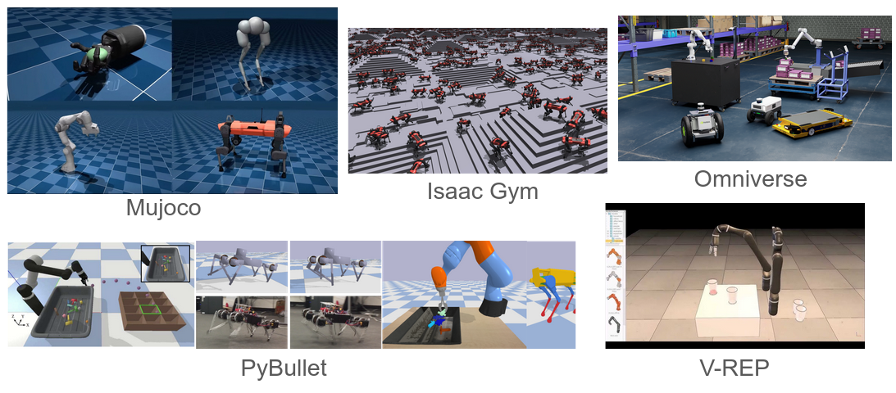

<!-- _class: cover_b -->
<!-- _header: "" -->
<!-- _footer: "" -->
<!-- _paginate: "" -->
<!-- _backgroundImage: url('https://marp.app/assets/hero-background.svg') -->

# Robot Perception and Control

###### Simulators

Last updated: Jul / 25 /2024
Kashu Yamazaki
kyamazak@andrew.cmu.edu

## Simulators

## Research oriented simulators

Popularized in robotics as sim2real research
- [Gymnasium (OpenAI Gym)](https://gymnasium.farama.org/): An API standard for single-agent reinforcement learning environments.
- [MuJoCo](https://mujoco.org/):
- [NVIDIA Issac]():
- [RaiSim](https://github.com/raisimTech/raisimlib):
- [PyBullet](https://pybullet.org/wordpress/):
- [Drake (MIT)](https://drake.mit.edu/): a robotics simulator developed by MIT and Toyota
- [Gazebo](http://gazebosim.org/): part of ROS.

## Game engines as simulators

General purpose (physics simulation, rendering, etc.) game engines:
* [Unity3D (Unity Technologies)]():
    * Barracuda: neural network interface for Unity
* [Unreal Engine (Epic Games)]():
* [CryEngine (Crytek)]():
* [Lumberyard (Amazon)]():
* [Stingray (Autodesk)]():
* [PhysX (Nvidia)](https://www.nvidia.com/en-us/drivers/physx/physx-9-19-0218-driver/):

## Differentiable Physics Engines