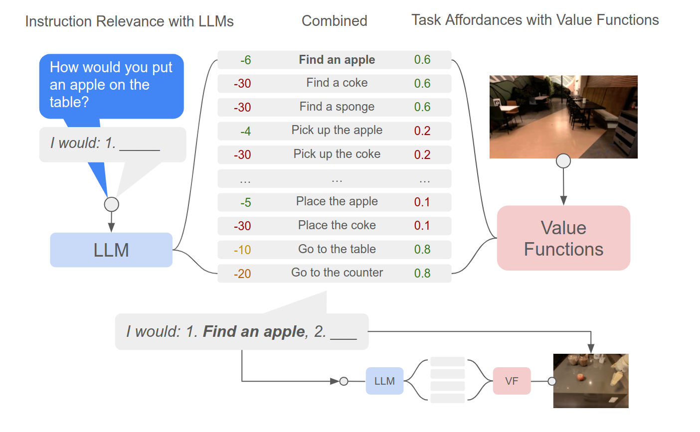

<!-- _class: cover_b -->
<!-- _header: "" -->
<!-- _footer: "" -->
<!-- _paginate: "" -->
<!-- _backgroundImage: url('https://marp.app/assets/hero-background.svg') -->

# Robot Perception and Control

###### LLM for Robotics

Last updated: Jul / 25 /2024
Kashu Yamazaki
kyamazak@andrew.cmu.edu

## SayCan (1/3)

With prompt engineering and scoring we can use LLM to break down an instruction into small, actionable steps. However, the **LLM doesn't know about the scene**, **embodiment** and the **situation it's in**. It needs what is call an affordance function!
- A robotic value functions as a way to provide what's feasible in the world given the current scene and embodiment.
- LLM checks what makes sense to do next given the grand plan, and the value function checks what is currently feasible

## SayCan (2/3)

SayCan [[1](https://say-can.github.io/)] obtains a skill that is both possible and useful with LLMs by:
- asking the LLM to interpret an instruction and **score the likelihood** that an individual skill makes progress towards completing the high-level instruction. 
- a **value function** that represents the probability of successfully executing said skill to select the skill to perform
<!-- ---
# SayCan -->

## SayCan (3/3)

## PaLM-SayCan

Just by changing the LLM to a more performant PaLM we got:
- better performance
- chain-of-thought prompting
- handling of queries in other languages

## Inner Monologue (1/3)

Inner Monologue [[1](https://innermonologue.github.io/)] bring in VLMs to provide feedback about the scene, task success etc.
All these different models talk to each other in natural language so that LLM can understand.

> VLMs bring a lot of non-robotic data into our system allowing us to get better planning feedback mechanisms. 
<!-- With better VLMs, our system can continue to get better without any new robotic data. -->

## Inner Monologue (2/3)
- **Success Detection** gives task-specific task completion information.
- **Passive Scene Description** gives structured semantic scene information at every planning step.
- **Active Scene Description** gives unstructured semantic information only when queried by the LLM planner.

## Inner Monologue (3/3)

## Code as Policies

Code as Policies [[1](https://code-as-policies.github.io/)] used LLMs to generate code to **directly control the robot**. 

## DIAL

DAIL [[1](https://instructionaugmentation.github.io/)] show that VLMs can significantly expand language labels without collecting any additional robot data. 

## NLMap (1/4)

NLMap [[1](http://nlmap-saycan.github.io)] showed VLMs can be used to query objects in the scene and allow for open-vocabulary queries in SayCan. NLMap addresses two core problems:
1. How to maintain open-vocabulary scene representations that are capable of locating arbitrary objects?
1. How to merge such representations within long-horizon LLM planners to imbue them with scene understanding?

## NLMap (2/4)

NLMap builds a natural language queryable scene representation with VLMs. An LLM-based object proposal module infers involved objects to query the representation for object availability and location. LLM planner (SayCan) then plans conditioned on such information.  

## NLMap (3/4)

**Natural Language Queryable Scene Representation**: 
1. The agent explores the scene and provides a class-agnostic bounding box proposal based on objectness. 
1. Extract 512d CLIP features and 512d ViLD features of each bounding box and represent them as a feature point cloud $C ={(φ_i,p_i,r_i)}_{i=1...N}$. 
1. When queried with a piece of text, visualize the heatmap of matches based on the alignment of text and visual features.
<!-- > Note that we can query with a single object name, or object families, such as “snack” or “fruit”. -->

## NLMap (4/4)
To complete a task specified by human instruction, the robot will query the scene representation for relevant information. 
1. parsing natural language instruction into a list of relevant object names
1. using the names as keys to query object locations and availability. 
1. generating executable options based on what’s found in the scene, then plan and execute as instructed.

## CLIP-Nav (1/3)

CLIP-Nav [[1](https://arxiv.org/pdf/2211.16649.pdf)] examines CLIP’s capability in making sequential navigational decisions, and study how it influences the path that an agent takes.

1. **Instruction Breakdown**: Decompose coarse-grained instructions into keyphrases using LLMs.
1. **Vision-Language Grounding**: Ground keyphrases in the environment using CLIP.
1. **Zero-Shot Navigation**: Utilize the CLIP scores to make navigational decisions.

## CLIP-Nav (2/3)

- Ground the NC on all the split images to obtain Keyphrase Grounding Scores (KGS). The *CLIP-chosen image* represents the one with the highest KGS, which drives the navigation algorithms. 
- Ground the AC and use the grounding score to determine if the agent has reached the target location (*stop condition*).

## CLIP-Nav (3/3)

<!-- _class: cols-2 -->

At each time step:
1. split the panorama into 4 images, and obtain the CLIP-chosen image 
1. obtain adjacent navigable nodes visible from this image using the Matterport Simulator, and choose the closest node. 

This is done iteratively till the *Stop Condition* is reached.

